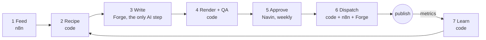

# agent-studio

An autonomous content pipeline that turns real business topics into original motion-design videos for 3 channels, with one AI step and one human approval per video. Every approved video goes out as three platform versions (YouTube, Instagram, Facebook), each rendered for its platform.

## The problem
Posting a good short video every day on 3 channels is a full-time job. AI "agents" that write animation code daily burn tokens, break things, and produce look-alike videos. Platforms also penalise mass-produced, repetitive content.

## How it works

## What makes it different
| Idea | How |
|---|---|
| Uniqueness is enforced by code | 7 novelty rules (topic, structure, opening, metaphor, theme, hook, cross-channel) are computed, not requested from an AI |
| 1 AI step | Only the words are written by an AI. Code picks the shape. Everything else is code or n8n |
| Human-approved | Nothing publishes without a ledger entry marked "approved" for that exact video and platform. One tap on Telegram per video |
| One render per platform | Each platform gets its own call to action (Subscribe on YouTube, Follow on Instagram), end card, caption and thumbnail, from the channel's style preset; each is checked, approved and dispatched on its own, and goes only to its own channel's account |
| Vocabulary, not templates | Tested motion primitives combined into recipes, in several formats (composed, host) and 5 themes, one brand identity |
| Sourced ideas | Topics come from real feeds with a source link. The writer can only pick from that list |

## Channels and roles
| Channel | Role | KPI | CTA |
|---|---|---|---|
| C1 automation | Leads: automation clients (Indian SMBs) | DMs + profile visits per reach | DM AUDIT, Follow (Subscribe on YouTube) |
| C2 Backstory | Followers: audience growth | Follows and sends per reach | Follow (Subscribe on YouTube), Send it |
| C3 studio (gated) | Leads: design and motion clients | Inbound enquiries | DM MOTION |

## Tech stack
| Part | Tool |
|---|---|
| Renderer + motion library | `engine/` (Remotion, React, TypeScript) |
| Orchestrator, feed, novelty, QA, approval, dispatch, metrics, learn | `studio/` (TypeScript on Node 26, no build step, no dependencies) |
| Writer | Forge (Muse tokens) |
| Feed fetching, YouTube upload and stats (one workflow per channel), approval webhook | n8n (relays only; the Mac checks and writes) |
| Instagram and Facebook posting | Forge Queue Publisher, from `queue/<channel>/<platform>/` manifests |
| Approvals and alerts | Telegram bot (Approve buttons; "agent-studio needs you") |
| Scheduler | `studio/run.ts`, an hourly idempotent tick (launchd) |
| State | Files (JSON, JSONL), no database |
| Build sessions | Claude Code |

## Status
| Phase | Scope | State |
|---|---|---|
| Docs + scaffold | This repo's plan and contracts | Done |
| A | Themes, primitives, Composer, text QA, host format (`engine/`) | Done |
| B | agent-studio core: feed, recipes, novelty, QA, approval, dispatch, learn | Done (B4b: render watcher on this engine installed; Forge's switch at go-live) |
| C | New primitives (22 in total, 5 families incl. camera) | Done |
| P | Production pass: metrics, per-channel output, hourly loop, crash-safe dispatch, Forge skills | Done |
| V | Platform variants (3 renders per video, per-variant QA, ledger and dispatch by channel and platform), C1 40 to 60 s, clean slate | Done |
| Go-live | Accounts, Forge skills, `"live": true` (`docs/SETUP.md`) | Waiting on Navin |
| D | Launch C2, then C3 (gated) | After go-live |

## How to run
- Checks (types, themes, text QA, schemas, every studio test incl. the end-to-end loop): `cd engine && npm run check`
- Render one storyboard (three platform videos): `cd engine && npm run make -- content/storyboards/<id>.json`
- One production tick by hand: `node studio/run.ts tick` (does nothing until a channel has `"live": true`)
- Rehearse a full cycle on real renders in a sandbox (nothing sent): `docs/SETUP.md` step 5.5, `node studio/simulate.ts`
- Go-live: `docs/SETUP.md`

Built by Navin Rana.
