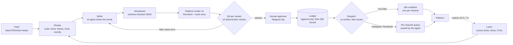

# Agent Studio

A deterministic, human-governed content operations system that turns sourced topics into platform-specific short videos, verifies every file independently, and publishes only the exact bytes a person approved.

[](LICENSE)


## Demo
<table><tr>
<td width="360" valign="top">

https://github.com/user-attachments/assets/0b320102-7cf2-4a57-982e-5fe07f4671e2

</td>
<td valign="top">

**A generated sample from the pipeline**: a test storyboard rendered by the engine and passed by QA (a verification render, not a channel post).

- **Topic:** chasing unpaid invoices: payment reminders typed by hand versus a reminder flow that runs itself every morning (illustrative example data).
- **Platform:** `c1-automation`, YouTube variant ("Subscribe" CTA and end card). The same board also renders Instagram and Facebook variants with their own CTA, end card and caption.
- **Format:** 44.18 s (allowed 40 to 60 s), 1080x1920, 30 fps, local Kokoro voice.
- **Built from:** `engine/test/style-c1.json`, style `c1-night-signal-v1`, recipe `style-test-c1`; 8 shots: word-stack-slam, pile-drop, ui-chat, before-after-split, flow-run, ui-sheet, counter-drop, end-card.
- **QA:** 12 of 12 checks passed ([qa-c1.txt](docs/proof/qa-c1.txt)).
- **Why this one:** the richer of the two verified boards (7 distinct primitives against 5), so one file exercises voice measurement, text fit and the platform CTA rules.

The player is a 4.3 MB re-encode (GitHub's inline limit is 10 MB). The original is [c1-automation-youtube-2026-10-04-style-c1.mp4](docs/proof/demo/c1-automation-youtube-2026-10-04-style-c1.mp4); its SHA-256 matches [c1-youtube.json](docs/proof/manifests/c1-youtube.json).

</td>
</tr></table>

## What this is
Agent Studio runs a small portfolio of short-video channels on YouTube, Instagram and Facebook from one Mac. Each week it plans the videos in code, has an AI agent write the words, renders one video per platform with a React motion engine and a local voice, checks every file with deterministic QA, and sends each passing video to its owner on Telegram. Nothing is published until that person taps Approve, and dispatch re-verifies everything right before sending.

| Automated | Human-controlled |
|---|---|
| Topic intake from listed feeds, weekly planning, novelty rules | Approving each video (one Telegram tap per video, or "Approve all" for videos already shown) |
| Writing the storyboard (AI) and fixing it until QA passes | Taking an approval back before it goes out (`node studio/ledger.ts reject <id>`) |
| Rendering three platform variants, voice, captions, thumbnails | Turning a channel live, and turning dispatch live (two separate switches) |
| QA, routing, dispatch, retries, publish confirmation, metrics intake | Resolving an upload whose result is unknown (the system never retries it blind) |
| Small, logged tuning (posting times, benched shots) from metrics | Any larger change Learn proposes (applied only on a tap) |

It has run in production since 4 October 2026: two channels live, posting every other day ([docs/proof/live.txt](docs/proof/live.txt)).

## Architecture


- **The Mac is the source of truth.** State is JSON and JSONL files in the repo's `state/`; n8n is a relay that holds platform credentials and asks the Mac before every upload.
- **Code decides, AI writes.** Planning, QA, approval, routing and learning are plain TypeScript. The AI agent fills in words and runs fixed posting skills.
- **One render per platform.** Each video becomes three independent files with their own call to action, end card, caption and approval line.

## Engineering principles
| Principle | How it is enforced |
|---|---|
| Deterministic execution | Recipes, QA, routing and learning are pure functions over files; no model call decides a state transition. The same inputs give the same plan. |
| Human-in-the-loop governance | `applyApproval` (`studio/ledger.ts`) is the only code path that writes `approved`, and only from a signed link or a tap from the owner's own Telegram chat. |
| Fail-closed behaviour | Every outward step re-checks its inputs immediately before acting and refuses with a reason; an unclear result is treated as "unknown", never as success. |
| Hash-bound approval | An approval records the SHA-256 of the exact video approved; a re-render needs a new approval, and dispatch sends only those bytes. |
| Platform isolation | A (channel, platform) pair has exactly one route: YouTube through that channel's own n8n workflow, Instagram and Facebook through that channel's own queue folder. |
| Idempotent dispatch | A variant is claimed (`dispatching`) before any call; each step is written before the next; a second run sends nothing; a crash resumes without re-uploading. |
| Append-only state | The ledger, fingerprints and metrics are JSONL; the latest line per key wins; a torn last line from a crash is ignored, a broken line elsewhere stops everything. |
| Schema contracts | Every exchanged file (idea, recipe, storyboard, manifest, QA result, ledger line, queue item, metrics) has a JSON Schema, checked by an in-repo validator that throws on unsupported keywords. |
| Independent QA | QA reads the rendered files, not the renderer's claims: it probes the MP4, measures text boxes from the real browser render and recomputes hashes. No vision model, no `--force`. |
| Reproducibility | Test boards, recipes and fixtures are in the repo; `npm run check` and `studio/simulate.ts` reproduce the verification on any Mac with Node 26. |

## Pipeline
1. **Feed** (`studio/feed.ts`): the Mac fetches only feeds listed in a `channel.json`, parses RSS/Atom, validates each idea against `idea.schema.json`, dedupes per channel and appends to `ideas/<channel>.jsonl` with its source link.
2. **Recipe** (`studio/recipe.ts`, `studio/novelty.ts`): code picks each posting day's shot list, theme, transitions and hook pattern; a draw that breaks a novelty rule against recent fingerprints is redrawn.
3. **Writer** (AI, `agents/writer/FORGE_WEEKLY_WRITER.md`): the agent writes one storyboard per recipe from the top ideas, within measured text limits, and runs the engine's `--check` gate before saving.
4. **Render** (`engine/`): the watcher renders each saved board once per platform from the channel's style preset, with a per-channel local voice measured line by line.
5. **QA** (`studio/qa.ts`): 12 checks per variant (schema, text limits, audio, format, duration, safe zones, fingerprint, naming, manifest, CTA, destination, SEO). A failing variant is held alone; the exact error goes back to the Writer.
6. **Approval** (`studio/telegram.ts`, `studio/ledger.ts`): each passing video reaches Telegram once; a tap writes one ledger line per passing variant with its hash.
7. **Dispatch** (`studio/dispatch.ts`): an hourly tick (and one right after a tap) plans, re-verifies and sends; YouTube as a private scheduled upload, Instagram and Facebook as queue items for the agent's posting skill.
8. **Publish and learn** (`studio/metrics.ts`, `studio/learn.ts`, `studio/improve.ts`): confirmations and metrics are accepted only for posts that were actually dispatched; Learn benches weak shots and tunes posting times with logged evidence, and proposes larger changes for a tap.

## Platform variants
| Platform | Call to action | Route | End card |
|---|---|---|---|
| YouTube | Subscribe | The channel's own n8n workflow (`agent-studio-youtube-<channel>`), private upload with a scheduled publish time | The channel's YouTube handle |
| Instagram | Follow (or "DM AUDIT") | `queue/<channel>/instagram/`, posted by the agent's Queue Publisher skill | The channel's Instagram handle |
| Facebook | Follow the page | `queue/<channel>/facebook/`, posted to the page by its numeric ID | The page's handle, or none while the username is pending |

Variants are independent because the platforms disagree on what is correct: YouTube must never say "Follow", Instagram and Facebook must never say "Subscribe", and each end card must name that platform's own account. Rendering each variant separately means each one is checked, approved, hashed, routed and retried on its own; a Facebook problem never holds the YouTube upload.

## Safety model
- **Signed approvals.** Approval links are HMAC-SHA256 over channel, week, ids, approver and expiry, single-use and expiring; the secret lives only in `.env`. Telegram taps count only from the configured private chat and go through the same `applyApproval`.
- **Hash verification.** QA records the hash of the file it checked; approval records the hash it approved; dispatch recomputes the hash of the bytes it is about to send and refuses on any difference.
- **Dispatch gates.** Right before sending: a valid ledger line still in the state the plan saw, the channel owns the board, the manifest matches the (channel, platform, video), exactly one publisher with the right route, the destination unchanged since render, QA passing for this exact file, the channel live, not already queued, and the YouTube SEO preflight.
- **Two switches.** A channel sends only with `"live": true` in its `channel.json`, and dispatch sends only with both `--live` and `DISPATCH_LIVE=on`. Experiments that change live YouTube titles need `EXPERIMENTS=on`.
- **Unknown uploads.** If n8n's answer is not a clear success or a clear refusal, the variant stays `dispatching` and is never resent automatically; the owner checks YouTube Studio and answers with a Telegram button or `node studio/dispatch.ts --resolve <id> <youtube id | none>`.
- **Defence in depth.** Each n8n upload workflow accepts only its own channel's jobs and asks the Mac's `/dispatch-check` before uploading; the receiver listens on 127.0.0.1 only and never logs a query string.
- **Refusal behaviour.** Every refusal carries a reason, is reported on Telegram (the same alert at most every 6 hours) and writes nothing.

## AI boundary
| Uses AI | Deterministic code |
|---|---|
| Writing each storyboard's words: hook, voice lines, on-screen text, caption (the Writer skill) | Choosing shots, theme, transitions, hook pattern and novelty (Recipe) |
| Fixing a storyboard after a QA error message | Every QA check, including text fit measured in the real render |
| Executing the posting and metrics-reporting skills through the agent's Meta connector, for items the queue manifest names | Approval verification, the ledger, routing, dispatch gates, retries, hash checks |
| Speech synthesis with local open-source TTS models (Kokoro by default) | Learn's scoring and the bounds on what it may change by itself |

The agent never chooses what is published, where, or when: the queue manifest names the account or page, the time and the video hash, and only approved, re-verified variants reach the queue.

## Repository structure
| Path | Contents |
|---|---|
| `studio/` | Orchestrator: feed, recipe, novelty, QA, ledger, approval receiver, Telegram, dispatch, metrics, learn, improve, experiments, simulation; `*.test.ts` beside each module |
| `engine/` | Remotion renderer: primitives, themes (WCAG AA gate), composer, text-fit measurement, render and watch scripts, local TTS bridge, test boards |
| `schemas/` | JSON Schemas for every exchanged file, the in-repo validator and samples |
| `styles/` | Versioned style presets with each platform's spec (size, CTA, end card, caption, route) |
| `channels/` | One folder per channel: `channel.json` (publishers, voice, cadence, live switch, feeds) and its rulebook |
| `agents/` | Each stage's contract (`RULES.md`) and the agent skills (Writer, Queue Publisher, Metrics Reporter) |
| `n8n/` | Exported n8n workflows: approval relay, per-channel YouTube upload, stats and packaging, feed trigger |
| `brand/` | Channel brand assets |
| `docs/` | Install, setup, operations, technical design, decisions, motion rules, proof pack |
| `state/`, `recipes/`, `ideas/`, `queue/`, `inbox/` | Runtime data, ignored by git |

## Quick start
Requirements: macOS 14+ and Node 26. Voiced renders also need Python 3.12 with `uv` and `espeak-ng` (docs/INSTALL.md section 4); n8n and Telegram are only needed to run it live.
```bash
git clone https://github.com/navin-labs/agent-studio.git
cd agent-studio/engine
npm install
npm run check                     # types, theme contrast, text QA, schema samples, 12 test suites (no renders)
npm run make -- test/demo.json    # a silent smoke render into engine/test/out/demo/
```
Reproduce the QA and the production simulation (needs the local voice, because a voiced channel never passes QA silent):
```bash
VOICE=on npm run make -- test/style-c1.json test/style-c2.json
cd ..
node studio/qa.ts engine/test/style-c1.json --out engine/test/out --recipes engine/test/recipes --date $(date +%F)
node studio/qa.ts engine/test/style-c2.json --out engine/test/out --recipes engine/test/recipes --date $(date +%F)
node studio/simulate.ts           # a full cycle on those renders in a temp sandbox; Telegram and n8n are fakes, nothing is sent
```
Running it for real (channels, n8n, Telegram, the agent, launchd services): [docs/INSTALL.md](docs/INSTALL.md), then [docs/SETUP.md](docs/SETUP.md).

## Verification
Run on 2026-10-04, Node 26.0.0, macOS on Apple silicon. Logs: [docs/proof/](docs/proof/README.md).

| Command | Result |
|---|---|
| `cd engine && npm run check` | exit 0: `tsc` clean; 41 theme contrast pairs pass, 0 fail; text QA ok; 19 schema samples valid; 12 of 12 test suites pass |
| `node studio/qa.ts` on `style-c1` and `style-c2` | YouTube, Instagram and Facebook pass on both boards: 12 of 12 checks per variant |
| `node studio/simulate.ts` | exit 0: 2 videos x 3 variants approved with one tap each and routed to their own channel; 10 refusal cases refused; a second run uploads and queues nothing |

The test suites cover the failure paths, not only the happy path: replayed, tampered and expired approvals; a video changed after approval; a variant rejected while dispatch is running; misrouted, unmanifested and already-queued variants; refused versus unknown uploads; a crash between claim and queue write; torn ledger lines; metrics for posts that were never dispatched.

## Current status
| Area | State |
|---|---|
| Implemented and verified locally | Everything in the pipeline above, by `npm run check`, QA on the test boards, and the sandbox simulation |
| In production | Since 2026-10-04 on the maintainer's Mac: C1 and C2 live, services under launchd, 8 n8n workflows active. Launch-day state: each channel's launch video dispatched as a scheduled YouTube upload plus queued Instagram and Facebook posts ([docs/proof/live.txt](docs/proof/live.txt)) |
| Depends on external accounts | YouTube OAuth credentials in n8n, a Telegram bot, an AI agent with a Meta (Instagram/Facebook) posting connector and scheduled tasks; none of these are in the repo |
| Not yet exercised in production | Learn and the Tier 2 proposals on real metrics (verified on fixtures until the first 24 h and 7 d readings arrive); title and thumbnail experiments |
| Off by default | `DISPATCH_LIVE` (dry run), each channel's `live`, `EXPERIMENTS` |
| Open | Facebook usernames pending (pages post by page ID meanwhile); channel KPI targets; C1's CTA mix; the third channel (`c3-studio`) has no style preset yet |
| Not provided | Hosted CI: verification runs locally. Automated end-to-end tests against live platforms: the simulation uses fakes by design |

## Design trade-offs
- **Filesystem and JSONL state, not a database.** One writer process at a time (a run lock), a few hundred rows a week, and files that n8n, the agent and a person can all read and diff. A database would add a server to run and back up for no gain at this scale; the cost is that it does not scale to many concurrent writers.
- **Mac-first, local execution.** Rendering needs a browser and a GPU-friendly machine, voices run locally, and launchd keeps the services up. The cost is one machine as a single point of failure; renders are copied to Google Drive, and the loop reports a missing or stopped watcher on Telegram.
- **n8n as a relay, not the brain.** n8n holds the platform OAuth credentials and handles uploads and schedules; every decision stays in tested TypeScript on the Mac, and each workflow asks the Mac before acting. The cost is two systems to deploy; the workflows are exported in `n8n/`.
- **Deterministic simulation instead of live end-to-end tests.** The simulation runs real renders through real QA, approval, ledger and dispatch code with fake Telegram and n8n. Live platform behaviour is covered by the fail-closed design (unknown results are never retried) rather than by tests that would post publicly.
- **Not a generic agent framework.** The AI does the one job that benefits from language generation; everything that can be wrong in a costly way (what is published, where, and whether it was approved) is ordinary code with tests. The system is deliberately specific to its channels, platforms and formats.

## Documentation
| Guide | For |
|---|---|
| [docs/INSTALL.md](docs/INSTALL.md) | A clean Mac to a running studio: tools, voice, configuration, n8n, the AI agent, services, verification |
| [docs/SETUP.md](docs/SETUP.md) | Channels, accounts and going live |
| [docs/OPERATIONS.md](docs/OPERATIONS.md) | Daily cycle, Telegram messages, health checks, troubleshooting |
| [docs/TECH.md](docs/TECH.md) | Technical design: variants, contracts, QA, approval, dispatch, learning, security |
| [docs/DECISIONS.md](docs/DECISIONS.md) | Architecture decision records |
| [docs/AGENTS.md](docs/AGENTS.md), [agents/](agents/) | Each actor's job, inputs, outputs and never-do list; the agent skills |
| [docs/MOTION.md](docs/MOTION.md), [engine/README.md](engine/README.md) | Motion rules, style presets, the render engine and voices |
| [n8n/README.md](n8n/README.md) | The n8n workflows and the Mac endpoints they call |
| [docs/proof/](docs/proof/README.md) | Verification logs, render manifests, the demo, the production snapshot |

Configuration is by variable name only; values never appear in the repo. Templates: [.env.example](.env.example) and [engine/.env.example](engine/.env.example).

## License
MIT, see [LICENSE](LICENSE). Third-party parts keep their own licences: Remotion has its own terms (free for individuals and small companies, a company licence beyond that); fonts are under the SIL Open Font License; icons are Lucide (ISC). See `engine/README.md`, "Licences".
