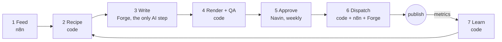

# agent-studio

An autonomous content pipeline that turns real business topics into original motion-design videos for 3 channels, with one AI step and one human approval a week.

## The problem
Posting a good short video every day on 3 channels is a full-time job. AI "agents" that write animation code daily burn tokens, break things, and produce look-alike videos. Platforms also penalise mass-produced, repetitive content.

## How it works

## What makes it different
| Idea | How |
|---|---|
| Uniqueness is enforced by code | 7 novelty rules (topic, structure, opening, metaphor, theme, hook, cross-channel) are computed, not requested from an AI |
| 1 AI step | Only the words are written by an AI. Code picks the shape. Everything else is code or n8n |
| Human-approved | Nothing publishes without a ledger entry marked "approved". One 5 minute review a week |
| Vocabulary, not templates | About 20 tested motion primitives at launch, combined into recipes, rendered in 4 themes |
| Sourced ideas | Topics come from real feeds with a source link. The writer can only pick from that list |

## Channels and roles
| Channel | Role | KPI | CTA |
|---|---|---|---|
| C1 automation | Leads: automation clients (Indian SMBs) | DMs + profile visits per reach | DM AUDIT, Follow |
| C2 reach | Followers: audience growth | Follows and sends per reach | Follow, Send to a friend |
| C3 studio | Leads: design and motion clients | Inbound enquiries | DM MOTION |

## Tech stack
| Part | Tool |
|---|---|
| Renderer + motion library | `engine/` (Remotion, React, TypeScript) |
| Orchestrator, novelty, QA, dispatch, learn | `agent-studio` (this repo), language TBD (owner: Navin) |
| Writer | Forge (Muse tokens) |
| Feeds, YouTube upload, approval webhook | n8n |
| State | Files (JSON, JSONL), no database |
| Build sessions | Claude Code |

## Status
| Phase | Scope | State |
|---|---|---|
| Docs + scaffold | This repo's plan and contracts | Done |
| A | Themes, primitives, Composer (`engine/`) | In progress (A1 done) |
| B | agent-studio core: recipes, novelty, QA, approval, dispatch, learn | Not started |
| C | 8 new primitives | Not started |
| D | Launch C2, then C3 (gated) | Not started |

## How to run
Placeholder until Phase B. See `docs/BUILD_PLAN.md`.

Built by Navin Rana.
