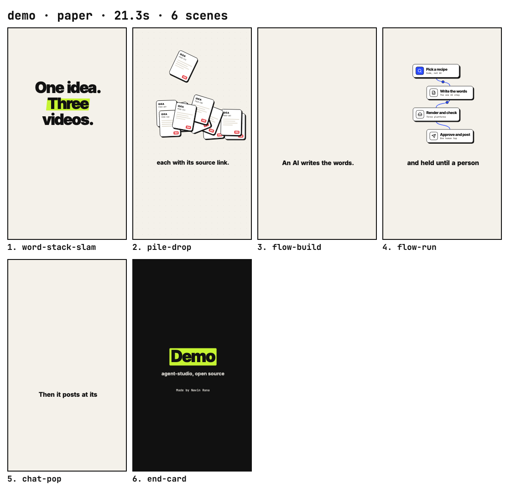
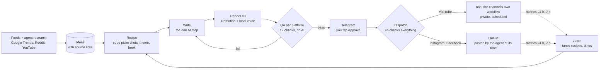

# agent-studio

An autonomous short-video studio: it turns sourced topics into motion-design videos, renders a version for each platform (YouTube, Instagram, Facebook), checks every file, and publishes nothing until a person approves that exact video on Telegram.

[](LICENSE)


**In production since 4 October 2026**, running two live channels on one Mac, every other day, on YouTube, Instagram and Facebook. The owner's only daily task is tapping Approve.

## Demo
[](docs/proof/demo/demo.mp4)

[Watch the demo (MP4, 21 s, 7.3 MB)](docs/proof/demo/demo.mp4): a neutral board about the pipeline itself, rendered by this engine with a local voice (`engine/test/demo.json`). Live channel output is not part of the repo.

## How it works

- **Code decides, AI writes.** Shot lists, themes, hook patterns, novelty rules, QA, routing and learning are deterministic code. An AI agent writes only the words, following the skills in `agents/`.
- **The Mac is the source of truth.** n8n relays (YouTube upload and stats, feed trigger, approval webhook) and asks the Mac before every upload.
- **Fail closed.** Every outward step re-checks its inputs right before acting and refuses with a reason on Telegram.

A day in production, step by step: [docs/OPERATIONS.md](docs/OPERATIONS.md).

## Features
- **Motion engine** (`engine/`): Remotion + React primitives in 5 families, WCAG AA themes, a composer, measured text-fit QA, a host character format, versioned style presets per channel.
- **Three platform versions per video**: each with its own call to action (Subscribe, Follow, Follow the page), end-card account, caption and file names.
- **Voice**: local open-source voices (Kokoro), measured per line; no paid voice API.
- **QA per platform**: format, measured duration, voice present, line lengths against each shot, safe zones, naming, manifest integrity, CTA wording, destination, SEO, novelty.
- **Approval bound to the file**: one tap approves a video's passing versions, each recorded with its SHA-256; a re-render needs a new approval.
- **Autonomous loop**: the watcher renders as boards arrive, a passing video reaches Telegram within a minute, an approval dispatches within a minute, and anything due today or tomorrow that is not on its way raises an alert.
- **Self-improving**: metrics feed Learn, which adjusts recipes and posting times by itself (logged with evidence) and proposes bigger changes for a one-tap decision.

## Documentation
| Guide | For |
|---|---|
| [docs/INSTALL.md](docs/INSTALL.md) | A clean Mac to a running studio: tools, voice, configuration, n8n, the AI agent, services, verification |
| [docs/SETUP.md](docs/SETUP.md) | Your channels and accounts, and going live |
| [docs/OPERATIONS.md](docs/OPERATIONS.md) | Daily cycle, Telegram messages, health checks, troubleshooting |
| [docs/TECH.md](docs/TECH.md) | Technical design: variants, contracts, QA, approval, dispatch, learning, security |
| [docs/MOTION.md](docs/MOTION.md) | Motion rules and style presets |
| [docs/DECISIONS.md](docs/DECISIONS.md) | Architecture decision records |
| [agents/](agents/) | Each stage's contract (`RULES.md`) and the agent skills (Writer, Queue Publisher, Metrics Reporter) |
| [n8n/README.md](n8n/README.md) | The n8n workflows |
| [docs/proof/](docs/proof/README.md) | Verification logs, the demo, the production state |

## Quickstart
Requirements: macOS 14+, Node 26, Docker (n8n), Python 3.12 with uv and espeak-ng for the voice. Full guide: [docs/INSTALL.md](docs/INSTALL.md).
```bash
git clone https://github.com/navin-labs/agent-studio.git
cd agent-studio
cp .env.example .env && cp engine/.env.example engine/.env   # fill in by name; never commit
cd engine && npm install
npm run check                                                 # types, themes, text QA, schemas, 12 test suites
npm run make -- test/demo.json                                # renders the demo into engine/test/out/demo/
cd .. && node studio/simulate.ts                              # a full production cycle in a sandbox, nothing sent
```

## Which AI agent runs the writing and posting
The skills in `agents/` are plain text. The agent needs file access to this repo, scheduled tasks, Instagram/Facebook posting and insights (for example a Meta Graph API connector), and web access. In production: Forge. Claude Code (scheduled tasks, plus a posting connector) and other agents with the same four capabilities can run them. Setup: [docs/INSTALL.md](docs/INSTALL.md) section 7.

## Configuration
Configuration is by name; values never appear in the repo. Templates: `.env.example` and `engine/.env.example`.

**Studio** (`.env`)
| Variable | Purpose |
|---|---|
| `APPROVAL_SECRET` | `<16+ random characters>`: signs approval links, verifies Telegram taps |
| `APPROVAL_WEBHOOK_URL` | `<n8n approval webhook URL>` |
| `TELEGRAM_BOT_TOKEN` | `<bot token>`: approvals and alerts |
| `TELEGRAM_CHAT_ID` | `<chat id>`: the one private chat whose taps count |
| `DISPATCH_LIVE` | `on` sends; anything else is a dry run |
| `EXPERIMENTS` | `on` allows YouTube title and thumbnail tests; default off |
| `APPROVE_PORT`, `STUDIO_STATE`, `STUDIO_RECIPES`, `N8N_WEBHOOK_BASE` | Optional overrides |

**Engine** (`engine/.env`)
| Variable | Purpose |
|---|---|
| `VOICE` | `on` renders voiceover; exactly one line (the first wins) |
| `TTS_PROVIDER`, `OPENAI_*`, `ELEVENLABS_*` | Optional paid voice providers instead of the local voice |
| `RENDER_COPY_DIR` | Optional `<folder>` where finished renders are copied |
| `PREVIEW_HANDLE`, `REMOTION_BROWSER_EXECUTABLE` | Optional |

Per channel (`channels/<id>/channel.json`): publishers (handles, Facebook page IDs, each YouTube channel's own n8n webhook), voice, style, cadence, live switch.

## Safety model
1. **QA per platform.** A failing version is held alone; QA records the hash of the file it checked.
2. **Approval per file.** Signed, single-use, expiring links and Telegram taps; each approval records the video's hash.
3. **Dispatch fails closed.** Right before sending: valid ledger line, the channel owns the board, manifest matches, one valid publisher, destination unchanged, QA passing for this exact file, hash equals the approved hash, channel live, not already queued.
4. **Switches.** A channel sends only with `"live": true`, and only when `DISPATCH_LIVE=on`.
5. **Never twice.** A version is claimed before sending; an unclear upload result is never retried by itself.
6. **Per-channel routing.** Each YouTube channel has its own n8n workflow that accepts only its own jobs; Instagram and Facebook items go to per-channel queue folders, posted to the account or page their manifest names.

## Verification
Verified on 2026-10-04 with Node 26.0.0 ([docs/proof](docs/proof/README.md)):

| Check | Result |
|---|---|
| `npm run check` | exit 0: `tsc` clean; 41 theme contrast pairs pass; textcheck ok; 19 schema samples ok; 12 of 12 suites pass |
| `node studio/qa.ts` on both test boards | YouTube, Instagram, Facebook pass, 36 of 36 checks per board |
| `node studio/simulate.ts` | all 6 versions approved and routed to their own channel; 10 refusal cases refused; a second run sends nothing |
| Production | 2 channels live; launch videos dispatched on 2026-10-04 to YouTube (scheduled), Instagram and Facebook (queued) |

| Test board | YouTube | Instagram | Facebook | Allowed |
|---|---|---|---|---|
| style-c1 | 44.18 s | 43.99 s | 44.35 s | 40 to 60 s |
| style-c2 | 30.59 s | 30.61 s | 30.66 s | 25 to 45 s |

## Repository layout
| Path | Contents |
|---|---|
| `engine/` | Remotion renderer, primitives, themes, composer, render and watch scripts, test boards |
| `studio/` | Orchestrator: feed, recipe, novelty, QA, ledger, approval receiver, Telegram, dispatch, metrics, learn, improve, simulation; `*.test.ts` beside each module |
| `schemas/` | JSON Schemas for every file the pipeline exchanges, with an in-repo validator and samples |
| `styles/` | Versioned style presets, with the per-platform spec |
| `channels/<id>/` | `channel.json` and the channel's rulebook |
| `agents/` | Stage contracts and the agent skills |
| `n8n/` | Exported n8n workflows |
| `brand/` | Brand assets for the end cards |
| `docs/` | Install, setup, operations, technical design, decisions, motion rules, log, proof |
| `state/`, `recipes/`, `ideas/`, `queue/`, `inbox/` | Runtime data, ignored by git |

## Contributing
Issues and pull requests are welcome.
- Keep changes small; match the surrounding style.
- `cd engine && npm run check` must pass; re-render and check any render a change touches.
- Primitives use theme role tokens only; no raw colours outside `engine/src/themes.ts`.
- No new dependencies without an issue first.
- Never commit `.env` files, credentials or runtime data.

## License
MIT. See [LICENSE](LICENSE). Third-party parts keep their own licences: Remotion has its own terms (free for individuals and small companies, a company licence beyond that); fonts are under the SIL Open Font License; icons are Lucide (ISC). See `engine/README.md`, "Licences".
