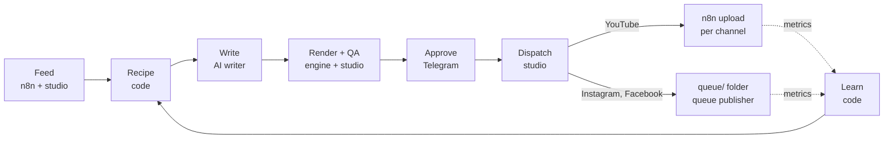

# agent-studio

A file-based pipeline that turns sourced topics into short motion-design videos, renders one version per platform, and publishes nothing without a human approval for that exact file.

[](LICENSE)


## What it is
agent-studio runs a small set of video channels from one Mac. Code picks each video's shape (shots, theme, hook pattern) from a tested motion vocabulary; one AI step writes the words; code renders, checks, routes and learns from the results. A person approves every video from Telegram before anything is sent.

It is built to be boring to operate: plain TypeScript on Node with no build step, state in JSON and JSONL files, an hourly idempotent tick, and every outward action checked again right before it happens.

## Features
- **Motion engine** (`engine/`): Remotion + React primitives in 5 families, themes that pass WCAG AA, a composer, text-fit QA, a host format, versioned style presets per channel.
- **Recipes and novelty by code**: weekly shot lists per channel; novelty rules (topic, structure, opening, metaphor, theme, hook, cross-channel) are computed, not asked of a model.
- **Platform variants**: every video renders three times (YouTube, Instagram, Facebook), each with its own call to action, end card account, caption and, for YouTube, thumbnail.
- **Per-variant QA**: deterministic checks on each rendered file (format, duration, safe zones, naming, manifest, CTA wording, destination, SEO). No vision model.
- **Telegram approvals**: one message per video lists its variants; one tap approves the variants that passed, bound to each file's SHA-256.
- **Fail-closed dispatch**: routing by the (channel, platform) pair to that channel's own destination; anything unexpected is refused and reported.
- **Self-improving loop**: daily metrics feed a learner that adjusts recipes automatically (Tier 1) and proposes bigger changes for a one-tap decision (Tier 2).

## Architecture

- The Mac is the source of truth. n8n only relays: it fetches feeds, uploads to YouTube and reads stats, and asks the Mac (`/dispatch-check`) before every upload.
- The writer and the Instagram/Facebook queue publisher are skills run by an external agent (prompts in `agents/`). They read and write files; they never decide what is published.
- `studio/run.ts` is the scheduler: an hourly tick under launchd that is safe to run any number of times.

## Repository layout
| Path | Contents |
|---|---|
| `engine/` | Remotion renderer, primitives, themes, composer, render and watch scripts, test boards |
| `studio/` | Orchestrator: feed, recipe, novelty, QA, ledger, approval server, Telegram, dispatch, metrics, learn, improve, simulation; `*.test.ts` beside each module |
| `schemas/` | JSON Schemas for every file the pipeline exchanges, plus an in-repo validator with samples |
| `styles/` | Versioned style presets, including the per-platform spec |
| `channels/<id>/` | `channel.json` (publishers, feeds, KPI, live switch) and the channel's rulebook |
| `agents/` | Contract (`RULES.md`) for each stage, and the writer, queue publisher and metrics reporter skills |
| `n8n/` | Exported n8n workflows (feed, approval webhook, YouTube upload, stats and packaging per channel) |
| `brand/` | Brand assets used by the end cards |
| `docs/` | Setup, technical design, decisions, motion rules, log, pre-launch verification proof (`docs/proof/`) |
| `state/`, `recipes/`, `ideas/`, `queue/` | Runtime data; ignored by git |

## Quickstart
Requirements: macOS (the watcher and the hourly tick use launchd), Node 26, npm. Rendering downloads a headless Chromium through Remotion on first use. Voiceover is optional and local (see `engine/README.md`, "Voice").

```bash
git clone <your fork URL> agent-studio
cd agent-studio
cp .env.example .env          # fill in the names listed below; never commit .env
cp engine/.env.example engine/.env
cd engine && npm install
npm run check                 # types, themes, text QA, schemas, every studio test
```

Render the two test boards (three platform videos each) into `engine/test/out/`, then check and rehearse a full cycle in a sandbox:
```bash
npm run make -- test/style-c1.json test/style-c2.json
cd ..
node studio/qa.ts engine/test/style-c1.json --out engine/test/out --recipes engine/test/recipes --date <render date>
node studio/simulate.ts
```
Going live (accounts, n8n workflows, launchd jobs, the live switches) is `docs/SETUP.md`.

## Configuration
All configuration is by environment variable name; values never appear in the repo. Templates: `.env.example` (studio) and `engine/.env.example` (engine).

**Studio** (`.env`)
| Variable | Purpose |
|---|---|
| `APPROVAL_SECRET` | `<random secret, 16+ characters>`: signs approval links and verifies Telegram taps |
| `APPROVAL_WEBHOOK_URL` | `<n8n approval webhook URL>`: the link target on the weekly approval page |
| `TELEGRAM_BOT_TOKEN` | `<bot token>`: the bot that sends approvals and alerts |
| `TELEGRAM_CHAT_ID` | `<chat id>`: the one private chat whose taps count |
| `DISPATCH_LIVE` | `off` by default; dispatch sends only with `on` and the `--live` flag |
| `EXPERIMENTS` | `off` by default; `on` allows title and thumbnail tests on live YouTube videos |
| `APPROVE_PORT` | Optional; approval receiver port (default `5680`) |
| `STUDIO_STATE`, `STUDIO_RECIPES` | Optional; override the `state/` and `recipes/` folders |
| `N8N_WEBHOOK_BASE` | Optional; base URL of the per-channel packaging webhooks |

**Engine** (`engine/.env`)
| Variable | Purpose |
|---|---|
| `VOICE` | `on` renders voiceover (local voices by default); otherwise sound effects only |
| `TTS_PROVIDER` | Optional; `openai` or `elevenlabs` instead of the local voice |
| `OPENAI_API_KEY`, `OPENAI_TTS_MODEL`, `OPENAI_TTS_VOICE`, `OPENAI_TTS_INSTRUCTIONS` | Optional; only with `TTS_PROVIDER=openai` |
| `ELEVENLABS_API_KEY`, `ELEVENLABS_VOICE_ID`, `ELEVENLABS_MODEL` | Optional; only with `TTS_PROVIDER=elevenlabs` |
| `RENDER_COPY_DIR` | Optional; `<folder>` the watcher copies finished renders to |
| `PREVIEW_HANDLE` | Optional; `<@handle>` for preview renders of a channel without one; such renders can never be dispatched |
| `REMOTION_BROWSER_EXECUTABLE` | Optional; path to a Chromium to use instead of the downloaded one |

YouTube destinations are not environment variables: each channel's own upload webhook is set in `channels/<id>/channel.json`, and there is no shared default.

## Platform variants and the safety model
Each style preset (`styles/<id>.json`) holds a spec per platform: size, CTA text and spoken line, end card account, caption template, thumbnail, file name rule, destination type.

| Platform | Call to action | Destination |
|---|---|---|
| YouTube | Subscribe | the channel's own n8n upload workflow; uploaded private with a scheduled publish time |
| Instagram | Follow | `queue/<channel>/instagram/`, posted by the queue publisher |
| Facebook | Follow the page | `queue/<channel>/facebook/`, posted to the page by its ID |

Renders land in `engine/out/<channel>/<date>/<id>/<platform>/`, every file named `<channel>-<platform>-<date>-<id>.<kind>`, with a schema-valid manifest that is the only thing downstream steps trust.

The safety model, end to end:
1. **QA per variant.** Each variant is checked on its own; a failing variant is held alone and the others can proceed. The QA result records the SHA-256 of the file it checked.
2. **Approval per file.** One Telegram tap writes one ledger line per passing variant, with that variant's hash. Approval links are signed, expire and work once; a re-render needs a new approval.
3. **Dispatch fails closed.** Right before sending, each variant is checked again: valid ledger line, known platform, channel owns the board, manifest present and matching, exactly one publisher that can receive posts (a pending username only on Facebook with a page ID) reached the platform's way, destination unchanged, QA passing for this exact file, the file's hash equal to the approved hash, channel live, not already queued. Any failure is a refusal with its reason on Telegram.
4. **Two switches.** Nothing is sent unless the channel has `"live": true` and `DISPATCH_LIVE=on` is combined with `--live`. Both default to off.
5. **Never twice.** A variant is claimed before sending; an unclear upload result is never retried automatically and waits for a human answer.
6. **n8n checks too.** Each upload workflow accepts only its own channel's YouTube jobs and asks the Mac before uploading.

Details: `docs/TECH.md` ("Variants") and `agents/dispatch/RULES.md`.

## The self-improving loop
Metrics (YouTube stats from n8n, Instagram and Facebook from the metrics reporter) flow into `studio/learn.ts` daily.
- **Tier 1, automatic and logged**: rest low performers, prefer primitives that hold viewers, prefer winning hook patterns, writer guidance on caption kind, CTA and length, posting times, thumbnail arms. Every change is written with its evidence to `state/learn/changes.jsonl`.
- **Tier 2, one tap**: switching a channel's style preset or retiring a primitive is proposed on Telegram with before/after evidence, once, and applied only on approval. Each changes one whitelisted setting; a guarded list is always refused.

## Testing
- `cd engine && npm run check`: TypeScript, the theme contrast gate, text QA, schema validation, then all 12 studio test suites. Must pass before every commit.
- `node studio/simulate.ts`: a production cycle on the real test renders in a temporary sandbox, with a fake Telegram and a fake n8n: approval, routing, refusal cases, queue placement, duplicates, published state. Nothing leaves the machine.
- `cd engine && npm run stress` and `npm run primitives`: text stress renders and contact sheets for every primitive.

## Verification
Reproducible pre-launch verification, run on 2026-10-04 with Node 26.0.0. Commands, raw logs, the six variant manifests and contact sheets: [docs/proof](docs/proof/README.md).

| Check | Result |
|---|---|
| `npm run check` | exit 0: `tsc` clean; theme gate 41 contrast pairs pass, 0 fail; textcheck ok; 19 schema samples ok; 12 of 12 suites pass |
| Test suites (assertion call sites) | recipe 44, qa 57, approval 53, dispatch 94, learn 23, telegram 52, metrics 16, run 24, feed 28, experiment 40, improve 30, loop 32 (493 total) |
| `node studio/simulate.ts` | exit 0: 2 videos x 3 variants; all 6 approved with one tap per video; plan 2 YouTube jobs and 4 queue items (Instagram by handle, Facebook by page ID), 0 blocked; 10 refusal cases refused; second run 0 uploads and 0 queue writes |
| `node studio/qa.ts` on `engine/test/style-c1.json` | YouTube, Instagram, Facebook pass (36 of 36 checks) |
| `node studio/qa.ts` on `engine/test/style-c2.json` | YouTube, Instagram, Facebook pass (36 of 36 checks) |

Measured test renders (all mp4, 1080x1920, 30 fps, with audio):

| Board | YouTube | Instagram | Facebook | Allowed |
|---|---|---|---|---|
| style-c1 | 45.78 s | 45.59 s | 45.95 s | 40 to 60 s |
| style-c2 | 30.59 s | 30.61 s | 30.66 s | 25 to 45 s |

The simulation's refusal cases: a channel pointed at another channel's workflow, missing manifest, unknown platform, wrong channel/platform pair, wrong channel on the ledger line, changed destination handle, Facebook username pending with no page ID, video changed after approval, approval taken back, duplicate queue item.

## Status
Pre-launch. The pipeline is complete and tested; every channel is `"live": false` and dispatch is off until the accounts and launch steps in `docs/SETUP.md` are done.

## Contributing
Issues and pull requests are welcome.
- Keep changes small and focused; match the surrounding style.
- `cd engine && npm run check` must pass, and renders touched by a change should be re-rendered and checked.
- Primitives use theme role tokens only; no raw colours outside `engine/src/themes.ts`.
- No new dependencies without discussion in an issue first.
- Never commit `.env` files, credentials, or runtime data (`state/`, `queue/`, renders).

## License
MIT. See [LICENSE](LICENSE).

Third-party parts keep their own licences: Remotion has its own licence terms (free for individuals and small companies, a company licence beyond that); fonts are under the SIL Open Font License; icons are Lucide (ISC). See `engine/README.md`, "Licences".
