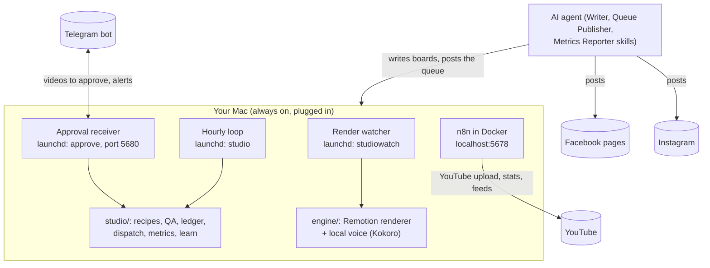

# INSTALL: from a clean Mac to a running studio

This guide takes a new machine to the same state as the production install: every service running, every check green, and the first video waiting for your approval on Telegram. Then follow `docs/SETUP.md` to connect your own channels and go live, and `docs/OPERATIONS.md` for daily operation.

No value in this repo is a credential. Where a secret is needed, this guide says where to get it; secret values go only in `.env` files (ignored by git) or in n8n's own credential store.

## 1. What runs where


| Component | Required | What it does |
|---|---|---|
| macOS 14 or later | yes | launchd runs the watcher, the hourly loop and the receiver. Tested on macOS 27 (Apple silicon). |
| Node.js 26 | yes | Runs the engine and the studio (TypeScript, no build step). |
| Docker Desktop | yes | Runs n8n (YouTube upload and stats, feed trigger, approval webhook). |
| n8n 2.x (Docker) | yes | Tested with n8n 2.31.4. |
| Python 3.12 + uv + espeak-ng | yes for voiceover | Local open-source voice (Kokoro). No paid voice API. |
| Telegram account + bot | yes | Your approval surface and alert channel. |
| Google Cloud project | yes for YouTube | OAuth client for the YouTube Data API v3 and YouTube Analytics API, used only inside n8n. |
| Instagram professional accounts + Facebook pages | yes for those platforms | Posted by your AI agent through its Meta connection. |
| An AI agent with file access and schedules | yes | Writes the scripts and posts Instagram and Facebook (section 7). |
| Google Drive for desktop | optional | The watcher copies every render there, so you can watch on your phone. |

## 2. Install the tools
```bash
# Homebrew (https://brew.sh), then:
brew install node git uv espeak-ng
brew install --cask docker
node --version   # v26.x
```
Start Docker Desktop once and keep it set to start at login.

## 3. Get the code and its dependencies
```bash
git clone https://github.com/navin-labs/agent-studio.git
cd agent-studio/engine
npm install
npm run check    # types, themes, text QA, schemas, 12 test suites: must end without errors
```
The studio (`studio/`) has no dependencies of its own. Remotion downloads a headless Chromium on the first render.
The code finds its files relative to the clone. The agent skills (section 7) and `docs/SETUP.md` assume the clone is at `~/Dev/projects/agent-studio` (`STUDIO`); clone there, or change the `STUDIO` line at the top of each skill (the only edit a skill needs).

## 4. Voice (local, one time)
```bash
cd engine
uv venv --python 3.12 .venv-voice/kokoro
VIRTUAL_ENV=.venv-voice/kokoro uv pip install "kokoro>=0.9.4" "transformers>=4.45" soundfile pip "en_core_web_sm @ https://github.com/explosion/spacy-models/releases/download/en_core_web_sm-3.8.0/en_core_web_sm-3.8.0-py3-none-any.whl"
.venv-voice/kokoro/bin/python scripts/tts_local.py --engine kokoro --voice af_heart --speed 1.15 --text "Hello." --out /tmp/a.wav
```
Each channel picks its voice in its `channel.json`, for example `channels/c1-automation/channel.json`: `"voice": {"engine": "kokoro", "voice": "af_heart", "speed": 1.15}`. Other engines: `engine/README.md` "Voice".

## 5. Configuration files
Copy the templates and fill in values. Never commit or paste these files.
```bash
cp .env.example .env
cp engine/.env.example engine/.env
```
**`.env` (studio)**
| Name | Value |
|---|---|
| `APPROVAL_SECRET` | 16+ random characters: run `openssl rand -hex 24` and paste the output |
| `APPROVAL_WEBHOOK_URL` | `http://localhost:5678/webhook/agent-studio-approve` |
| `TELEGRAM_BOT_TOKEN` | the token @BotFather gives you when you create the bot (`/newbot`) |
| `TELEGRAM_CHAT_ID` | your private chat with the bot: send the bot any message, then open `https://api.telegram.org/bot` followed by your token and `/getUpdates` in your own browser; the number at `chat.id` is the value |
| `DISPATCH_LIVE` | `off` while installing; `on` at go-live (the last line with this name wins) |
| `EXPERIMENTS` | `off` (YouTube title and thumbnail tests; leave off unless you want them) |

**`engine/.env` (engine)**
| Name | Value |
|---|---|
| `VOICE` | `on`. Exactly one `VOICE=` line: the engine reads the **first** line with a name. Without it every render is silent, and QA refuses silent renders for a channel that has a voice. |
| `RENDER_COPY_DIR` | optional: the folder finished renders are copied to. Default: Google Drive for desktop, `My Drive/Reel Engine` |

To set `VOICE` safely without opening the file:
```bash
cd engine && sed -i '' '/^VOICE=/d' .env && printf '\nVOICE=on\n' >> .env && grep -c '^VOICE=on$' .env   # prints 1
```

## 6. n8n
1. Run n8n in Docker with the host reachable as `host.docker.internal` (Docker Desktop does this by default) and the editor on `http://localhost:5678`.
2. In n8n, create the credentials (Credentials > New). Names are yours; the workflow files reference them by name, so either use the names in `n8n/README.md` or re-select them in each workflow after import:
   - one **YouTube OAuth2** credential per YouTube channel (scopes for upload and read),
   - one **YouTube Analytics** OAuth2 credential per channel (stats).
3. Import and publish every file in `n8n/`, then restart n8n (an import unpublishes a workflow until the restart):
   ```bash
   for f in n8n/*.json; do docker cp "$f" n8n_main:/tmp/x.json && docker exec n8n_main n8n import:workflow --input=/tmp/x.json; done
   for id in agStudioApprove1 agStudioFeed1 agStudioYoutube1 agStudioYoutube2 agStudioYtStats1 agStudioYtStats2 agStudioPack1 agStudioPack2; do docker exec n8n_main n8n publish:workflow --id=$id; done
   docker restart n8n_main n8n_worker   # the container names of a standard n8n queue-mode setup; use yours
   ```
4. Point each YouTube channel at its own upload webhook in its `channel.json`: C1 `http://localhost:5678/webhook/agent-studio-youtube-c1-automation`, C2 `http://localhost:5678/webhook/agent-studio-youtube-c2-reach`. There is no shared default.
5. Phone-verify each YouTube channel (youtube.com/verify) so scheduled uploads and custom thumbnails are allowed. Shorts show a frame of the video, not a custom thumbnail.

Details per workflow: `n8n/README.md`.

## 7. The AI agent (writer and Instagram/Facebook publisher)
The studio's only AI step, and the Instagram and Facebook posting, are three plain-text skills in `agents/`. Any agent can run them if it has:

| Capability | Why |
|---|---|
| Read and write files in this repo on the Mac | Reads recipes, ideas and rulebooks; writes boards to `engine/content/storyboards/` and metrics to `inbox/metrics/` |
| Scheduled tasks (hourly, daily, weekly) | Queue Publisher hourly, Board Keeper hourly, Weekly Writer on Thursdays, Metrics Reporter daily |
| Instagram and Facebook posting and insights (for example a Meta Graph API connector) | Posts queued Reels to the account or page the manifest names; reads post insights |
| Web access | Opens idea sources so every idea carries a real link |

| Agent | Status |
|---|---|
| Forge (Muse) | In production with this studio |
| Claude Code (desktop app scheduled tasks, or the CLI under a scheduler) | Meets the file and schedule needs; add an Instagram/Facebook posting connector (MCP) for the publisher |
| Other agents (for example ChatGPT agents, Codex) | Usable if they meet all four capabilities above |

Install the three skills verbatim (they are the contract; do not summarise them):
| Skill | File | Schedule (your time zone) |
|---|---|---|
| Weekly Writer | `agents/writer/FORGE_WEEKLY_WRITER.md` | Thursdays 12:00, plus an hourly "Board Keeper" run that writes any missing board for this or next week and fixes any failing board from its `.status.txt` |
| Queue Publisher | `agents/publisher/FORGE_QUEUE_PUBLISHER.md` | every hour |
| Metrics Reporter | `agents/learn/FORGE_METRICS_REPORTER.md` | every day |

The agent never touches YouTube, recipes, engine code, `state/` or queue manifests.

## 8. Background services (launchd)
```bash
node studio/approve-server.ts --install     # approval receiver + Telegram polling (com.theautomationguy.approve)
cd engine && npm run watch:install && cd ..  # render watcher (com.theautomationguy.studiowatch)
node studio/run.ts --install                 # hourly loop (com.theautomationguy.studio)
launchctl list | grep theautomationguy       # three services
curl -s 127.0.0.1:5680/health                # ok
```
Keep the Mac on power and awake (System Settings > Battery > Options > prevent automatic sleeping when the display is off). A sleeping Mac pauses rendering, n8n, the loop and Telegram until it wakes.

## 9. Verify the install (no account touched)
```bash
cd engine && npm run check && cd ..
cd engine && VOICE=on npm run make -- test/style-c1.json test/style-c2.json && cd ..
node studio/qa.ts engine/test/style-c1.json --out engine/test/out --recipes engine/test/recipes --date $(date +%F)
node studio/qa.ts engine/test/style-c2.json --out engine/test/out --recipes engine/test/recipes --date $(date +%F)
node studio/simulate.ts      # a full production cycle in a sandbox: fake Telegram, fake n8n, nothing sent
node studio/dispatch.ts --live   # with DISPATCH_LIVE=off: "dry run", nothing sent
```
Expected results: `docs/proof/verification.md`. A neutral demo render (no channel, no account) is `engine/test/demo.json`.

Next: `docs/SETUP.md` (your channels, accounts and go-live) and `docs/OPERATIONS.md` (daily life and troubleshooting).
