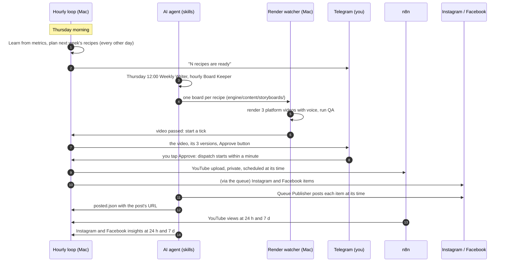

# OPERATIONS: running the studio day to day

The studio runs on its own. The owner's only daily job is to watch each new video on Telegram and tap **Approve**. Everything else happens on a schedule, and anything that needs a person announces itself on Telegram.

## The daily and weekly cycle


| When (IST) | What | Who |
|---|---|---|
| 07:00 daily | Feeds fetched, new ideas with their source links | n8n + studio |
| hourly | Tick: send ready videos, dispatch approved ones, mark published, read metrics, alert | studio (launchd) |
| hourly at :00 | Post due Instagram and Facebook items | agent, Queue Publisher |
| hourly at :30 | Write missing boards, fix failing ones | agent, Board Keeper |
| 09:00 daily | Instagram and Facebook insights | agent, Metrics Reporter |
| 10:00 daily | YouTube statistics | n8n |
| Thursday morning | Learn, then next week's recipes planned | studio |
| Thursday 12:00 | Next week's boards written | agent, Weekly Writer |
| per video | Approve on Telegram | you |

Posting days: every other day from each channel's `cadence.start` (`channels/c1-automation/channel.json`, `channels/c2-reach/channel.json`). Posting times per channel and platform: `state/learn/posting-times.json`; Learn changes a time only when it has evidence.

## What Telegram tells you
| Message | Meaning | What to do |
|---|---|---|
| A video with Approve | Rendered, voiced, passed QA on every listed platform | Watch it; tap Approve, or ignore it to skip |
| `Approved: c1-2026-w41-1 (instagram, youtube, facebook)` | Recorded; dispatch starts within a minute | Nothing |
| `c1-automation 2026-W42: 4 recipes are ready` | Next week is planned | Nothing; the agent writes it |
| `agent-studio needs you: c1-2026-w41-1 (2026-10-06): not written yet` | A video due today or tomorrow has no board | Ask the agent to run its Board Keeper |
| `c1-2026-w41-1 (2026-10-06): fails QA: c1 video is 38.8s, needs 40 to 60s` | The board keeps failing a check | Usually the agent fixes it within the hour; if it repeats, forward the error to the agent |
| `c1-2026-w41-1 (2026-10-06): ready, waiting for your Approve on Telegram` | A video due soon is not approved | Approve it, or let it skip |
| `blocked c1-2026-w41-1 instagram: the video changed after it was approved` | Dispatch refused, for the reason given | Fix the cause it names (often a channel setting), or ignore if intended |
| `YouTube did not answer clearly` with Uploaded / Not uploaded | Upload result unknown; never retried by itself | Check YouTube Studio, then tap the matching button |

The same alert repeats at most every 6 hours.

To stop things:
- Take back an approval before it posts: `node studio/ledger.ts reject c1-2026-w41-1` (the video id from its Telegram message).
- Pause a channel: `"live": false` in its `channel.json`.
- Pause all sending: `DISPATCH_LIVE=off` in `.env`.

## Health check
```bash
launchctl list | grep theautomationguy     # approve, studiowatch, studio
curl -s 127.0.0.1:5680/health              # ok
tail -5 state/run.log                      # the last ticks
tail -5 engine/out/watch.log               # the last renders
node studio/dispatch.ts --live             # what would be sent now (sends only due, approved items)
cd engine && npm run check                 # all checks
```

## Troubleshooting: every failure seen in production, and its fix
| Symptom | Cause | Fixed by |
|---|---|---|
| Videos rendered silent | `VOICE=on` missing from `engine/.env` (the watcher reads that file, not your shell) | QA now fails a silent render for a channel with a voice. Set `VOICE` with the command in `docs/INSTALL.md` section 5, then re-render |
| Approve taps had no effect | The Telegram poller hung on a dropped connection | Every Telegram call has a timeout; the poller recovers by itself. If taps still do nothing: `launchctl kickstart -k gui/$(id -u)/com.theautomationguy.approve` |
| YouTube upload marked "unknown" though it uploaded | The n8n workflow read the video id from the wrong field | Workflows read `uploadId`. For an old case, find the id in the n8n execution, then `node studio/dispatch.ts --resolve c1-2026-w41-1 QL_4Qj5fCmo` (video id, then the YouTube id) |
| A resolved upload never counted as published | The claim did not keep its publish time | Claims record `scheduled_for` |
| Approved posting times vanished | Learn rewrote the file with no data | Learn changes only platforms with evidence |
| A board stuck between "line too long" and "video too short" | Line length was estimated from words, which miscounts a fast voice | Lines are judged by their measured voice clip, with a 0.5 s hold allowed (the shot stretches to its line; the voice is never cut) |
| A video failed at exactly 40.0 s | The renderer counted frames, QA measured the file | Both measure the file |
| Finder `.DS_Store` crashed a scan | Folder scans read every entry | Scans skip dotfiles |
| Reddit ideas stopped | Reddit blocks browser-like User-Agents | The feed sends a descriptive bot User-Agent |
| A demo showed the brand handle | Boards without a channel fell back to the C1 handle and logo | Boards without a channel show no account and no logo |
| A video needed a manual command to reach Telegram | The loop ran only hourly | The watcher starts a tick when a video passes; an approval starts one too; ticks never overlap (lock) |

Re-render a board without changing it (for example after fixing `engine/.env`): remove its entry from `engine/out/.watch-state.json`, then `launchctl kickstart -k gui/$(id -u)/com.theautomationguy.studiowatch`.

## Changing things safely
- Posting frequency: `cadence.every_days` (2 = every other day, 1 = daily) in `channel.json`; recipes for weeks already planned keep their days.
- Look: `"style"` in `channel.json` (a style preset in `styles/`), or approve Learn's Tier 2 proposal on Telegram.
- After any code change: `cd engine && npm run check`, then `launchctl kickstart -k` the receiver and the watcher.
- After changing an n8n workflow file: import, publish, restart n8n (`docs/INSTALL.md` section 6).
