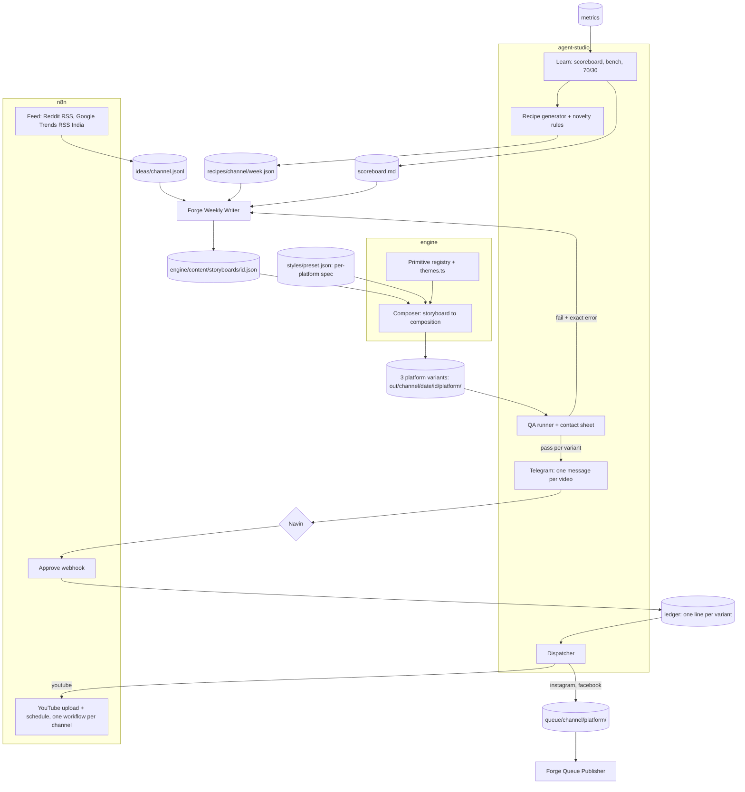

# TECH: agent-studio

Why: code picks the shape, an AI writes the words, a human approves once a week.

## Architecture

## Repos
One repo (ADR 7).

| Folder | Owns |
|---|---|
| `engine/` | Motion library (primitives), `themes.ts`, Composer, renderer, gate, watcher |
| root | Schemas, recipes, novelty, QA, approval page, dispatch, learn, channel config, docs |
| `~/Dev/projects/reel-engine` | Old live engine (v1). Read-only; retired at task B4b |

## Stack
| Layer | Choice |
|---|---|
| Rendering | Remotion 4, React 19, TypeScript (`engine/`, copied from reel-engine v1) |
| agent-studio language | TypeScript on Node 26 (type stripping, no build step, no dependencies), `studio/` (ADR 17) |
| Media checks | @remotion/media-parser (`engine/scripts/probe.ts`) |
| Voice | local Kokoro per channel (`channel.json` `voice`, `engine/scripts/tts_local.py`); Parler-TTS and Chatterbox installed as fallbacks; no voice API |
| Automation | n8n (feeds, YouTube upload, approval webhook) |
| Writer | Forge (Muse tokens) |
| Storage | Files in repo `state/` and Google Drive; no database |
| Host | Navin's Mac (watcher via launchd) |

## Data contracts (`schemas/`)
| Schema | Written by | Read by |
|---|---|---|
| idea | Feed: n8n fetches, `studio/feed.ts` parses, checks and writes `ideas/<channel>.jsonl` | Writer |
| recipe | Recipe | Writer, QA |
| storyboard | Writer | Composer, QA |
| style | Navin (a new version is a new file; Learn may propose a switch) | Recipe, renderer (per-platform spec), QA, dispatch |
| manifest | Renderer, one per platform variant (QA sets `qa_status`) | QA, approval, dispatch |
| qa | QA, one per platform variant | Telegram, approval page, approval, dispatch, Writer (on fail) |
| ledger | Approval, Dispatch (one line per platform variant) | Dispatch, Learn, metrics |
| queue | Dispatch (one per Instagram or Facebook item) | Forge Queue Publisher, `markPublished` |
| metrics | Forge (Instagram/Facebook files in `inbox/metrics/`) and n8n (YouTube views), both checked by `studio/metrics.ts` | Learn |
| fingerprint | Approval (one per video) | Recipe (novelty), QA |
| channel | Navin | All steps |

## Themes and role tokens
Motion rules and the two channel signature styles (`night-signal`, `archive-gold`, on review): docs/MOTION.md.
Role tokens (every theme defines all): `bg, surface, ink, muted, rule, accent, onAccent, flow, ok, alert, shadow`. `onAccent` is text on the highlighter (ADR 8).

| Theme | Used by |
|---|---|
| night, night-signal | C1 (through its style preset) |
| archive, archive-gold | C2 (through its style preset) |
| paper, ink, mono, studio | C3 (gated) |

Values live only in `engine/src/themes.ts`.

Rules (enforced by `npm run gate:themes`, which `make.mjs` runs before every render): WCAG AA contrast (ink on bg, ink on surface, onAccent on accent, muted on bg and surface); max 3 colours per frame; no raw colour (hex, rgb, hsl, white, black) in `src/` outside `themes.ts`; new themes need Navin's OK once. Brand fixed everywhere: Inter Tight + JetBrains Mono, signal-lime highlighter, 3px strokes, hard offset shadows, ink-wipe end card, authorship line.

## Novelty rules (Recipe redraws until all pass)
| Check | Rule |
|---|---|
| Topic | Text similarity to last 60 posts (all channels) < 0.75 (trigram / TF-IDF) |
| Structure | Jaccard distance of primitive set + ordered pairs >= 0.6 vs each of the channel's last 10 |
| Opening | Differs from yesterday's; same opening at most 2 times in 7 days |
| Hero metaphor | Not repeated within 14 days on the channel |
| Theme | Not 3 days in a row on the channel |
| Hook pattern | Not 3 in a row; caption opener doesn't repeat the previous 2 posts |
| Cross-channel | Same recipe fingerprint never on two channels in the same week |

Code: `studio/novelty.ts` (the 7 rules, pure), `studio/recipe.ts` (seeded generator, `node studio/recipe.ts <channel> <week>` writes `recipes/<channel>/<week>.json`), test `studio/recipe.test.ts` (8 weeks x 2 channels, each rule fires on a crafted case; in `npm run check`). Recipe decides shape only, so it enforces structure, opening, theme, hook pattern and cross-channel; topic, hero metaphor and caption opener exist only after writing and are checked by QA with the same functions. Video shapes per format (C1 host and explainer 8 beats, C2 reach and C3 composed 6 beats) live in `FORMATS` in recipe.ts. Recipe also hands out only shot lists that can reach the channel's length floor: the shots' maximum seconds, times 0.9, must reach it (`reachable`; C1 shot lists allow at least about 44 s), since no line may run past its shot's maximum. Opening rule means a format with one opener (host: `host-hook`) runs at most 2 times a week.

## Primitives (`engine/src/primitives/`)
| Part | Where |
|---|---|
| Spec: family, channels, min/max seconds, cues, text limits, example (test storyboard) | `specs.ts` (pure data, readable from Node) |
| Validator for params | `validateParams(id, params)` in `specs.ts` |
| Component: one full-frame shot, `{p, dur, cues}`, draws only in the stage band y 280 to 1080 | `<id>.tsx`, registered in `index.ts` |
| Contact sheet (8 frames) and preview video | `Preview.tsx`; `npm run primitives [-- --all-themes]` |

## Composer (`engine/src/composer/`)
| Part | Where |
|---|---|
| Storyboard type, scene timing, cue frames, `validateStoryboard` (Node-readable) | `storyboard.ts` |
| Composition: one Sequence per scene, captions from `vo`, cues from `*accent*` runs, transitions cut / whip-pan / ink-wipe / pixel-wipe / fold (9 frames), voice audio | `Composer.tsx` |
| Scene length | vo estimate (or measured voice) within the primitive's min/max; measured voice is never cut |
| Render | `npm run make -- content/storyboards/<id>.json`: one render per platform into `out/<channel>/<date>/<id>/<platform>/` (the watcher renders every board saved in `content/storyboards/`). Boards anywhere else (tests) render to `engine/test/out/` |
| Transitions | cut, whip-pan (motion blur), ink-wipe (from the bottom), pixel-wipe (120 px blocks in a fixed pseudo-random order, `lib/pixels.ts`) |
| Closing | the last scene must be a closer (`end-card` or `host-cta`) |
| Checks | `npm run check` = TypeScript (`tsc`, strict) + theme gate + text QA self-test + schema samples (`schemas/validate.ts`); run before every commit |

## Formats (ADR 13)
| Format | Look | Built from | Channel, length |
|---|---|---|---|
| host | `night` theme, a channel mascot hosting, karaoke captions always on | host primitives + Composer (`"host"`, `"captionStyle": "karaoke"` in the storyboard), 8 beats | C1, 40 to 60 s |
| explainer | composed, 8 beats: hook, pain, pain, contrast, flow, result, payoff, end card | primitives + Composer | C1, 40 to 60 s |
| reach (story) | composed, 6 beats: hook, the world before, the turn, one idea, why it matters, end card | primitives + Composer | C2, 25 to 45 s (40 to 60 s with the phase-2 history shots) |
| composed | any theme, 6 beats, keyword captions | primitives + Composer | C3 (gated), 20 to 45 s |
| story (legacy) | Paper & Signal, one continuous world (`pile-to-flow`) | `engine/src/story/Story.tsx` | tests only (`engine/test/stories/`) |

Host layer (`engine/src/host/`): `mascots.tsx` (characters drawn in SVG with a 7-step pixel dither; inputs mouth, blink, tilt), `Host.tsx` (idle bob, blink every ~3 s, tilt toward the active panel, happy hop, pain shake; mouth from voice loudness via `@remotion/media-utils`, else pulsed on caption word timing; karaoke captions), `acting.ts` (pure maths, asserted in `npm run primitives`).

## QA checks (deterministic, per platform variant)
schema, text-limits, audio, format (mp4, the preset's size for that platform, 30 fps), duration, safe-zones, fingerprint (recipe + novelty), naming, manifest, cta, destination, seo. Each variant gets its own `qa.json` (recording the SHA-256 of the file it checked) and `qa_status` in its manifest; a variant that fails is held alone; approval and dispatch accept a QA result only for that exact file. The full table is in `agents/render-qa/RULES.md`. Code: `studio/qa.ts` (pure `evaluate()` + runner), test `studio/qa.test.ts` in `npm run check`.

Text boxes (built in A5): while a storyboard renders, `TextProbe` (Composer.tsx) measures every visible text block on settled frames (every 5th, fonts loaded, transitions skipped) and emits it as a Remotion `<Artifact>`. `make.mjs` writes the variant's `text-boxes.json` and runs `textcheck.ts`: error if text leaves any platform safe area (`SAFE_ZONES`: Instagram x 60..1020, y 250..1500; YouTube Shorts x 60..960, y 180..1530, the right 120 px is the button column) or its card. Layouts keep text inside `SIDE` = 120 px on both sides (theme.ts), plus 20 px headroom on zoomed big type; warning if a caption overlaps shot text. The render fails if any sampled frame did not report. Only visible text counts: boxes are trimmed to clipping ancestors; trimmed text is an error ("cut off by its window") unless it sits in a `data-tb-scroll` area (chat history). Stress fixture `engine/test/stress-ui.json` (every UI field and every host big-type field at max length) must render with 0 errors: `npm run stress`.

Length per channel (`LENGTH` and `boardFormat` in storyboard.ts): C1 40 to 60 s in both formats, no exceptions (Navin, 2026-10-03); C2 25 to 45 s until its phase-2 history shots (archive photo pan, document reveal, timeline) make 40 to 60 s reachable; C3 20 to 45 s. Before render the estimate only warns; after render the real length fails the render when every vo line was measured (voiced), and QA fails any variant outside its range.

## Packaging, retention and SEO (Part 4, 2026-10-03)
Three concepts ported from darkzOGx/youtube-automation-agent (MIT): ideas only, no code, no merge.
- SEO preflight (`studio/seo.ts`): the YouTube title, description and tags come from the storyboard (`youtubeMeta`, also used by dispatch). Rules with IDs: SEO-T1 empty title, T2 over 70 chars (warn), T3 under 20 (warn), T4 dashes or emojis, D1 thin description (warn), G1 under 3 tags (warn), G2 tags over 500 chars, G3 over 15 hashtags, K1 no title keyword in tags (warn); C2 adds S1 source link in the description and H1 a name or year in the title (warn). Errors fail QA (check `seo`, arm B's `title_b` too) and block dispatch; warnings ride with the Telegram approval. Category: 28 (C1, C3), 27 Education (C2).
- Scene retention (`studio/retention.ts`): every render writes each scene's span to its variant's `render.json` (Learn reads the YouTube variant's). n8n reads YouTube Analytics `audienceWatchRatio` by `elapsedVideoTimeRatio` with the YouTube reading; the row carries `retention`. Learn maps the curve onto scenes (hold = viewers at the scene end / at its start), compares each primitive with the channel's average at the same scene position, and writes `retention.holds` / `retention.leaks` (from 3 videos, quartiles). Recipe prefers holds and keeps leaks out of the opening shot. YouTube only: Instagram has no per-second curve.
- Thumbnails and experiments (`engine/src/thumbnail/Thumbnail.tsx`, `studio/experiment.ts`): the YouTube variant renders `<prefix>.thumbnail.png` (the hook, 1280x720, channel theme); a board with `meta.thumb_b` / `meta.title_b` also renders arm B (`<prefix>.thumbnail-b.png`). QA requires them on the YouTube variant; Telegram shows them with the video, so one approval covers both arms. Dispatch uploads with thumbnail A. After publishing, arms rotate by Pacific day ABBAAB (publish day skipped), then the control is restored; evidence is thumbnail CTR (z-test, 1000 impressions per arm) when YouTube reports it, else views labelled "views, not CTR"; a winner needs 95% and must not lose over 5% average view percentage. B is applied for good only after Navin's separate "Adopt B" tap. Changing a live title or thumbnail is an account change: only with `EXPERIMENTS=on`, live channels, and n8n's packaging workflow asks the Mac (`/packaging-check`) before every change.

Not taken, on purpose: its AI video-generation core (our composed brand formats are the moat), Shorts repurposing, and its dashboard and approval system (we have approvals and Telegram). Reason: YouTube's inauthentic-content policy (YouTube Partner Program) demonetizes mass-produced, templated videos. It was renamed from "repetitious content" on July 15, 2025; detailed guidance was published on July 16, 2026. Enforcement is channel-wide, not per video: one templated pattern can cost the whole channel its monetization. Our design stays approval-first, human-edited, with sourced claims; nothing here changes that.

## Security
| Rule | Enforced by |
|---|---|
| `.env` files are never committed or printed | `.gitignore` (`.env`, `.env.*`, credential file patterns); code and docs refer to variables by name only |
| No publish without ledger status "approved" for that platform variant | Dispatcher refuses otherwise |
| Only the approved bytes go out | The ledger line carries the approved video's SHA-256; dispatch refuses a changed file and sends the bytes it hashed |
| One channel's video never reaches another channel's account | Per-channel YouTube webhook (`/webhook/agent-studio-youtube-<channel>`, no shared default); each n8n workflow takes only its own channel's jobs and asks `/dispatch-check` with its channel and platform; queue folders per channel and platform; manifest destination re-checked against channel.json |
| An approval link approves once | The link's signature id is recorded on the ledger line; a replay (also after a rejection) is refused |
| Nothing publishes outside Dispatch | Only `studio/dispatch.ts` sends, behind the live switches and the ledger checks above |
| Forge writes only JSON into content folders and its own queue/inbox files; never edits engine code | Forge skill standing rules |
| Ideas only from feeds with a source link | Writer rules; `meta.source` required by storyboard schema |

## Approval (B4)
| Part | Where |
|---|---|
| Telegram (main path) | `studio/telegram.ts`: one message per QA-passed video with its passing variant's video, each platform variant's status (ready with its CTA, or held with why) and one **Approve (<platforms>)** button; "Approve all" once the week is shown. Taps count only from TELEGRAM_CHAT_ID in that private chat and go through the same signed approval as the links |
| Weekly page | `node studio/approval-page.ts <channel> <week>` -> `state/approval/<channel>/<week>/index.html` + contact sheets. One card per recipe slot: contact sheet, hook, caption, per-variant QA. Only QA-passed videos get an Approve link |
| Signed links | HMAC-SHA256 over channel, week, ids, approver, expiry (7 days; Telegram taps 60 s). Env names: `APPROVAL_WEBHOOK_URL` (https), `APPROVAL_SECRET` (16+ chars), in agent-studio/.env |
| Webhook relay (n8n) | Receives the GET, passes the query string unchanged to the Mac receiver (`studio/approve-server.ts`, `/approve`), which runs `applyApproval`. n8n does not need the secret and cannot forge or widen an approval. n8n runs in Docker on the Mac and reaches the receiver at host.docker.internal:5680 |
| Apply | `studio/ledger.ts`: verifies signature and expiry, refuses a link already used, then per id: storyboard found, same channel, in that week; then per platform whose publisher is not pending (or is Facebook with a page_id): rendered, QA passed, the video still the one QA checked. One tap covers the master and its variants; a variant that failed QA is held alone. Writes one line per approved variant to `state/ledger.jsonl` (append-only, latest line per (video, platform) wins, schema-checked, with the video's SHA-256 and the link id) and the video's fingerprint to `state/fingerprints.jsonl` once |
| Test | `studio/approval.test.ts` and `studio/telegram.test.ts` in `npm run check` |

## Production loop (`studio/run.ts`)
One idempotent tick, every hour (LaunchAgent com.theautomationguy.studio). Only channels with `"live": true` are touched.
| Step | When | What |
|---|---|---|
| fingerprints | every tick | `repairFingerprints()`: an approval that crashed between the ledger and the fingerprint write is healed |
| metrics | every tick | `studio/metrics.ts`: Forge's files in `inbox/metrics/` -> checked -> `state/metrics.jsonl`; bad files to `rejected/` with the reason |
| plan | Thursday, once per channel and week | Learn for next week, then `planWeek()` writes `recipes/<channel>/<week>.json` (never overwrites); Telegram: "recipes are ready" |
| telegram | every tick | each QA-passed video of this and next week, once, one message covering its platform variants, with an Approve button; "Approve all" only covers videos already shown |
| dispatch | every tick | per platform variant (ledger line): approved, every check in `agents/dispatch/RULES.md` passes -> YouTube (that channel's own n8n webhook) or `queue/<channel>/<platform>/`. Per variant: claim (`dispatching`) -> upload or queue write (manifest last, atomic) -> YouTube URL written at once -> `dispatched`. Certainly-not-uploaded (n8n `{uploaded:false}`, connection refused) releases the claim for a retry; unknown (5xx, timeout, garbled) stays stuck until Navin answers on Telegram or runs `node studio/dispatch.ts --resolve <id> <youtube id | none>`; a local failure after the upload resumes without uploading again. Every refusal is a problem on Telegram |
| published | every tick | Forge's `<prefix>.posted.json` in a queue folder -> that variant `published` with its URL; a YouTube variant once its scheduled publish time has passed |
Problems go to Telegram ("agent-studio needs you") with the exact reason; one failing step never stops the others.

## Self-improving loop (2026-10-03)
metrics -> Learn -> Recipe and Writer -> render -> Telegram approval -> dispatch -> metrics, every week, with no coding and no prompting.
- Learn (`studio/learn.ts`) runs daily for live channels (hourly tick) and before each Thursday plan. Findings in `state/learn/<channel>/learn.json`: KPI per primitive (plus scene retention against the channel average at the same position), per style version, hook pattern, caption kind, CTA, length and posting hour; nothing judged under 3 videos; a winner needs a 10% lead over a runner-up with 3+.
- Tier 1, applied without a tap, every change logged with its evidence in `state/learn/changes.jsonl`: rest the bottom quartile 2 weeks, prefer primitives that hold viewers and keep leaks out of the opener, prefer winning hook patterns (Recipe), Writer guidance on caption kind, CTA and length (copied into each recipe's `guidance`), posting times (Dispatch), thumbnail arms (studio/experiment.ts, EXPERIMENTS=on).
- Tier 2 (`studio/improve.ts`), proposed on Telegram with before/after evidence and what Learn expects, only when the evidence is there, each once, applied only by Navin's Approve tap: switch the style preset (a newer version once the current one has a baseline; back to a version 10% better over 6+ videos each), take a primitive out of the grammar for good (retention <= 0.85 over 6+ videos, or rested twice; `state/learn/<channel>/grammar.json`).
- Guarded, never changed by Learn or a tap: voices, colour tokens, the AI-voiceover disclosure, C2's every-claim-sourced rule, approval gates, `live`, dispatch switches. A tap writes exactly `channel.json` `style` or the grammar removals; anything else is refused (tested).
- The weekly note goes with the Thursday recipes: what changed by itself and why, what waits for a tap, what is tested next.
- Test: `studio/improve.test.ts` drives the real tick on planted data.

## Channels and formats
| Channel | Formats (recipe.ts `FORMATS`) | Style preset | Closer CTA kinds |
|---|---|---|---|
| C1 automation | host (Chiku), explainer; both 40 to 60 s | `c1-night-v0` (night); on review `c1-night-signal-v1` | follow, dm-audit |
| C2 Backstory | reach: hook, the world before, the turn, one idea shown, why it matters, follow card (docs/FORMATS_PROPOSAL.md); 25 to 45 s | `c2-archive-v0` (archive); on review `c2-archive-gold-v1` | follow, send |
| C3 studio | composed (explainers for example brands) | none yet: gated, cannot render until it has one | DM MOTION |
The closer shows the account of the platform it is rendered for (the preset's `end_card.handle`; make.mjs reads channel.json; a pending handle is never shown). No real Instagram handle, no render; `PREVIEW_HANDLE` only for sample weeks, and Dispatch refuses those renders.

## Variants (2026-10-03)
Every approved video goes out as three platform variants, each its own render, its own ledger line, its own QA, its own dispatch. Two live channels make six videos per cycle.

| | Where | Rule |
|---|---|---|
| Spec | `styles/<id>.json` `platforms.{youtube,instagram,facebook}` | size (1080x1920), thumbnail (YouTube: required), end_card.handle, caption template (`{body}`, `{cta}`, `{voice}`, `{hashtags}`), cta per kind (text, sub, say, line), filename (`{channel}-{platform}-{date}-{id}`), destination (YouTube `n8n`, the others `forge-queue`). Checked by `schemas/style.schema.json` and `schemas/validate.ts` |
| Renders | `engine/out/<channel>/<yyyy-mm-dd>/<video id>/<platform>/` | `<channel>-<platform>-<date>-<id>.mp4`, `.caption.txt`, `.manifest.json` (written last), `.qa.json`, `.contact.png`, `.cover.png`, `.render.json`, `.text-boxes.json`, YouTube `.thumbnail.png` (and `.thumbnail-b.png`). Every file name carries channel, platform, date and video id, in render folders and in the queue alike; a bare name (`video.mp4`, `final.mp4`) fails QA |
| Manifest | `schemas/manifest.schema.json` | channel, platform, video_id, date, style_version, voice, cta_kind, cta_text, cta_say, end_card_handle, destination (via, handle, page_id), size, video_sha256, qa_status, files |
| Queue | `queue/<channel>/<platform>/` (Instagram, Facebook) | `<prefix>.mp4`, `<prefix>.caption.txt`, `<prefix>.manifest.json` (`schemas/queue.schema.json`: channel, platform, video_id, date, handle, page_id for Facebook, scheduled_for, video_sha256, files; written last); Forge adds `<prefix>.posted.json` `{posted_at, url}` |
| Ledger | `state/ledger.jsonl` | one line per (video, platform); `lkey(id, platform)` |
| Approval | Telegram | one tap covers the master and its variants; each variant approved only if its QA passed |
| Routing | `studio/dispatch.ts` | by the (channel, platform) pair: YouTube to that channel's own n8n webhook, Instagram and Facebook to that channel and platform's queue folder; any mismatch, missing manifest, unknown pair or wrong destination is refused and reported on Telegram |
| Code | `studio/variant.ts` | the one place that names folders and files |

## n8n and Forge boundaries (contracts)
| Boundary | Direction | Contract | Fails safe by |
|---|---|---|---|
| Feed | n8n -> Mac | `GET /feeds` -> `[{source, url}]` (from channel.json `feeds`); `POST /feed {url}`: the Mac fetches it (only listed feeds) -> `{added, skipped, items}` (`{url, body}` also accepted) | unlisted URL never fetched; non-200 (403 blocked, 429 rate limited), non-feed text or no items: 400 with the reason, nothing written; items without a link skipped; dedupe by id and link per channel |
| Approval | Telegram / n8n -> Mac | Telegram tap from TELEGRAM_CHAT_ID, or `GET /approve?<signed query>` | bad signature, expiry, failed QA, wrong week: refused, nothing written |
| Resolve | Telegram -> Mac | an unknown upload gets one message per claim with **Not uploaded** (`n|<id>`) and **Uploaded** (`u|<id>`, then a forced reply with the video ID or link); signed like approvals (HMAC, 60 s) and gated to TELEGRAM_CHAT_ID | wrong chat, a reply to anything else, or a bad ID: nothing written; never an automatic retry |
| Upload | Mac -> n8n -> YouTube | multipart `job` (with `channel`, `platform: youtube`) + `video` (+ `thumbnail`) to `/webhook/agent-studio-youtube-<channel>`; that workflow takes only its own channel's YouTube jobs, then asks `GET /dispatch-check?id=&channel=&platform=youtube` (yes for a fresh claim or a planned upload of that channel; channel and platform are required); reply `{uploaded: true, youtube_id}` or `{uploaded: false, reason}` | a wrong channel or platform, a missing parameter or a no from the Mac: 403 `{uploaded: false}`, nothing uploaded; anything else is "unknown": never retried by itself |
| YouTube stats | n8n -> Mac | `GET /metrics-due?channel=` (one stats workflow per YouTube channel) -> `[{storyboard_id, channel, platform, window, video_id}]`; `POST /metrics [rows]` | rows for videos never dispatched (or wrong channel/platform): 400, none written |
| Packaging (experiments) | Mac -> n8n -> YouTube | multipart `job` {video_id, title, description, tags, category_id} + optional `thumbnail` to `agent-studio-packaging-<channel>`; n8n asks `GET /packaging-check?id=&channel=&video_id=&title=` first (channel required); experiment days: `GET /experiment-days-due?channel=`, `POST /experiment-days` | a change nobody planned: 403, nothing touched; only with `EXPERIMENTS=on` and a live channel |
| Writer | Mac -> Forge -> Mac | `recipes/<ch>/<week>.json` -> `engine/content/storyboards/<recipe id>.json`; watcher writes `<id>.status.txt` (`ok`, `failed`, `failed QA` + exact errors per platform) | QA checks shots/theme/hook/transitions against the recipe; Forge fixes and saves again |
| Publish | Mac -> Forge -> Mac | `queue/<channel>/<platform>/<prefix>.mp4`, `.caption.txt`, `.manifest.json` (written last) -> Forge posts to exactly the manifest's account -> `<prefix>.posted.json {posted_at, url}` | no manifest = still being written; a manifest that disagrees with its folder, or a `posted.json` whose URL is not on that platform, is reported, never trusted |
| Meta metrics | Forge -> Mac | one file per video/platform/window in `inbox/metrics/` | bad file -> `inbox/metrics/rejected/` with `.error.txt` |

## Crash safety
All state is append-only JSONL. A crash mid-append leaves a torn last line: readers ignore it and the next append cuts it off; a broken line anywhere else stops everything as corruption. Approval writes the ledger, then fingerprints; `repairFingerprints()` fills a fingerprint lost in between. Dispatch claims each variant before calling out (above). A re-render replaces a video's variant folders whole, so a platform that fails to render never leaves an older render (and its QA pass) behind.
