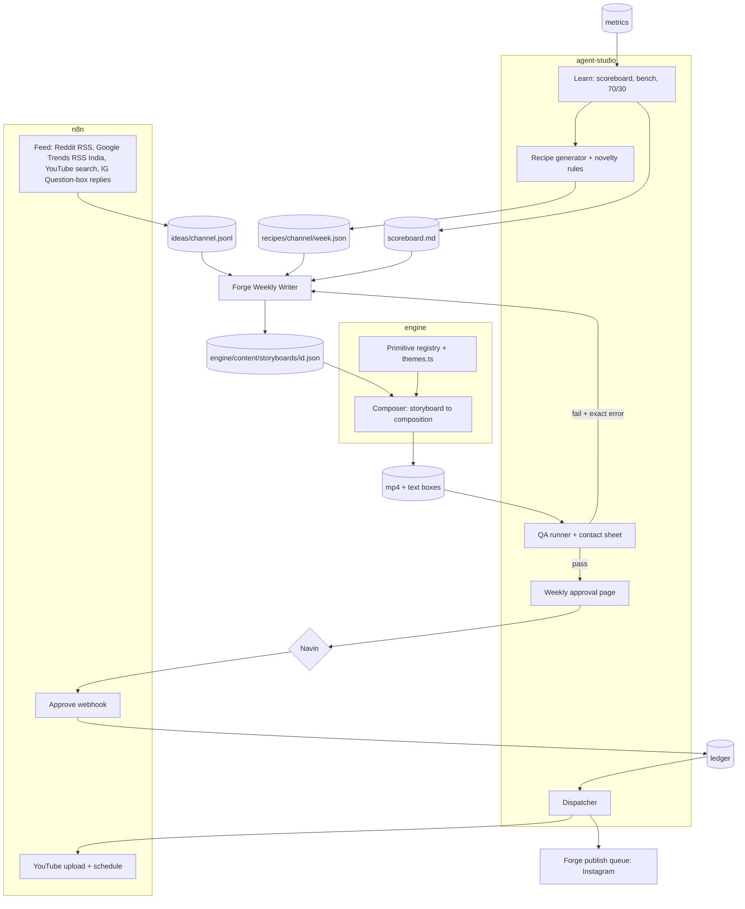

# TECH: agent-studio

Why: code picks the shape, an AI writes the words, a human approves once a week.

## Architecture

## Repos
One repo (ADR 7).

| Folder | Owns |
|---|---|
| `engine/` | Motion library (primitives), `themes.ts`, Composer, renderer, gate, watcher |
| root | Schemas, recipes, novelty, QA, approval page, dispatch, learn, channel config, docs |
| `~/Dev/projects/reel-engine` | Old live engine (v1). Read-only; retired at task B4b |

## Stack
| Layer | Choice |
|---|---|
| Rendering | Remotion 4, React 19, TypeScript (`engine/`, copied from reel-engine v1) |
| agent-studio language | TypeScript on Node 26 (type stripping, no build step, no dependencies), `studio/` (ADR 17) |
| Media checks | ffprobe |
| Automation | n8n (feeds, YouTube upload, approval webhook) |
| Writer | Forge (Muse tokens) |
| Storage | Files in repo `state/` and Google Drive; no database |
| Host | Navin's Mac (watcher via launchd) |

## Data contracts (`schemas/`)
| Schema | Written by | Read by |
|---|---|---|
| idea | Feed: n8n fetches, `studio/feed.ts` parses, checks and writes `ideas/<channel>.jsonl` | Writer |
| recipe | Recipe | Writer, QA |
| storyboard | Writer | Composer, QA |
| qa | QA | Approval page, Writer (on fail) |
| ledger | Approval webhook, Dispatch | Dispatch, Learn |
| metrics | Forge (Instagram/Facebook files in `inbox/metrics/`) and n8n (YouTube views), both checked by `studio/metrics.ts` | Learn |
| fingerprint | Recipe | Recipe (novelty), QA |
| channel | Navin | All steps |

## Themes and role tokens
Role tokens (every theme defines all): `bg, surface, ink, muted, rule, accent, onAccent, flow, ok, alert, shadow`. `onAccent` is text on the highlighter (ADR 8).

| Theme | bg | surface | ink | accent | Default for |
|---|---|---|---|---|---|
| paper | #F4F1EA | #FFFFFF | #111111 | #C6F432 | C1 |
| ink | #0E0E0E | #1A1A1A | #F4F1EA | #C6F432 | C2, C3 |
| mono | #E4E3DF | #F4F4F2 | #161616 | #C6F432 | C2, C3 |
| studio | #FFFFFF | #F6F6F6 | #0B0B0B | #2B4BFF | C1 alternate, C3 |

Rules (enforced by `npm run gate:themes`, which `make.mjs` runs before every render): WCAG AA contrast (ink on bg, ink on surface, onAccent on accent, muted on bg and surface); max 3 colours per frame; no raw colour (hex, rgb, hsl, white, black) in `src/` outside `themes.ts`; new themes need Navin's OK once. Brand fixed everywhere: Inter Tight + JetBrains Mono, signal-lime highlighter, 3px strokes, hard offset shadows, ink-wipe end card, authorship line.

## Novelty rules (Recipe redraws until all pass)
| Check | Rule |
|---|---|
| Topic | Text similarity to last 60 posts (all channels) < 0.75 (trigram / TF-IDF) |
| Structure | Jaccard distance of primitive set + ordered pairs >= 0.6 vs each of the channel's last 10 |
| Opening | Differs from yesterday's; same opening at most 2 times in 7 days |
| Hero metaphor | Not repeated within 14 days on the channel |
| Theme | Not 3 days in a row on the channel |
| Hook pattern | Not 3 in a row; caption opener doesn't repeat the previous 2 posts |
| Cross-channel | Same recipe fingerprint never on two channels in the same week |

Code: `studio/novelty.ts` (the 7 rules, pure), `studio/recipe.ts` (seeded generator, `node studio/recipe.ts <channel> <week>` writes `recipes/<channel>/<week>.json`), test `studio/recipe.test.ts` (8 weeks x 2 channels, each rule fires on a crafted case; in `npm run check`). Recipe decides shape only, so it enforces structure, opening, theme, hook pattern and cross-channel; topic, hero metaphor and caption opener exist only after writing and are checked by QA with the same functions. Video shapes per format (host 8 beats, composed 6 beats) live in `FORMATS` in recipe.ts. Opening rule means a format with one opener (host: `host-hook`) runs at most 2 times a week.

## Primitives (`engine/src/primitives/`)
| Part | Where |
|---|---|
| Spec: family, channels, min/max seconds, cues, text limits, example (test storyboard) | `specs.ts` (pure data, readable from Node) |
| Validator for params | `validateParams(id, params)` in `specs.ts` |
| Component: one full-frame shot, `{p, dur, cues}`, draws only in the stage band y 280 to 1080 | `<id>.tsx`, registered in `index.ts` |
| Contact sheet (8 frames) and preview video | `Preview.tsx`; `npm run primitives [-- --all-themes]` |

## Composer (`engine/src/composer/`)
| Part | Where |
|---|---|
| Storyboard type, scene timing, cue frames, `validateStoryboard` (Node-readable) | `storyboard.ts` |
| Composition: one Sequence per scene, captions from `vo`, cues from `*accent*` runs, transitions cut / whip-pan / ink-wipe, voice audio | `Composer.tsx` |
| Scene length | vo estimate (or measured voice) within the primitive's min/max; measured voice is never cut |
| Render | `npm run make -- content/storyboards/<id>.json` (watcher also watches `content/storyboards/`) |
| Transitions | cut, whip-pan (motion blur), ink-wipe (from the bottom), pixel-wipe (120 px blocks in a fixed pseudo-random order, `lib/pixels.ts`) |
| Closing | the last scene must be a closer (`end-card` or `host-cta`) |
| Checks | `npm run check` = TypeScript (`tsc`, strict) + theme gate + text QA self-test + schema samples (`schemas/validate.ts`); run before every commit |

## Formats (ADR 13)
| Format | Look | Built from |
|---|---|---|
| story | Paper & Signal, one continuous world (`pile-to-flow`) | `engine/src/story/Story.tsx` (legacy, live) |
| composed | any theme, sequenced shots, keyword captions | primitives + Composer |
| host | `night` theme, a channel mascot hosting, karaoke captions always on | host primitives + Composer (`"host"`, `"captionStyle": "karaoke"` in the storyboard) |

Host layer (`engine/src/host/`): `mascots.tsx` (characters drawn in SVG with a 7-step pixel dither; inputs mouth, blink, tilt), `Host.tsx` (idle bob, blink every ~3 s, tilt toward the active panel, happy hop, pain shake; mouth from voice loudness via `@remotion/media-utils`, else pulsed on caption word timing; karaoke captions), `acting.ts` (pure maths, asserted in `npm run primitives`).

## QA checks (deterministic)
Schema and text limits, audio stream present, 1080x1920 @ 30fps, duration per format (host 40 to 60 s, composed 20 to 45 s), safe zones from text boxes measured at compose time, storyboard matches its recipe + novelty rules, file naming (`<id>.json`, `out/<id>/`). Code: `studio/qa.ts` (pure `evaluate()` + runner), test `studio/qa.test.ts` in `npm run check`. Output: `qa.json` + `contact.png` (every scene at mid-shot) next to the video.

Text boxes (built in A5): while a storyboard renders, `TextProbe` (Composer.tsx) measures every visible text block on settled frames (every 5th, fonts loaded, transitions skipped) and emits it as a Remotion `<Artifact>`. `make.mjs` writes `out/<id>/text-boxes.json` and runs `textcheck.ts`: error if text leaves any platform safe area (`SAFE_ZONES`: Instagram x 60..1020, y 250..1500; YouTube Shorts x 60..960, y 180..1530, the right 120 px is the button column) or its card. Layouts keep text inside `SIDE` = 120 px on both sides (theme.ts), plus 20 px headroom on zoomed big type; warning if a caption overlaps shot text. The render fails if any sampled frame did not report. Only visible text counts: boxes are trimmed to clipping ancestors; trimmed text is an error ("cut off by its window") unless it sits in a `data-tb-scroll` area (chat history). Stress fixture `engine/test/stress-ui.json` (every UI field and every host big-type field at max length) must render with 0 errors: `npm run stress`.

Length per format (`LENGTH` in storyboard.ts): host 40 to 60 s, composed 20 to 45 s. Before render the estimate only warns; after render the real length fails the render when every vo line was measured (voiced), and warns when it is still an estimate.

## Security
| Rule | Enforced by |
|---|---|
| Never read or print `.env` | `.claude/settings.json` deny rules; CLAUDE.md |
| No publish without ledger status "approved" | Dispatcher refuses otherwise |
| Claude never publishes; never force-pushes | CLAUDE.md; force push denied |
| Forge writes only JSON into content folders; never edits engine code | Forge skill standing rules |
| Ideas only from feeds with a source link | Writer rules; `meta.source` required by storyboard schema |

## Approval (B4)
| Part | Where |
|---|---|
| Weekly page | `node studio/approval-page.ts <channel> <week>` -> `state/approval/<channel>/<week>/index.html` + contact sheets. One card per recipe slot: contact sheet, hook, caption, QA result. Only QA-passed videos get an Approve link; "Approve all" covers exactly those |
| Signed links | HMAC-SHA256 over channel, week, ids, approver, expiry (7 days). Env names: `APPROVAL_WEBHOOK_URL` (https), `APPROVAL_SECRET` (16+ chars), in agent-studio/.env |
| Webhook relay (n8n) | Receives the GET, passes the query string unchanged to the Mac receiver (`studio/approve-server.ts`, `/approve`), which runs `applyApproval`. n8n does not need the secret and cannot forge or widen an approval. n8n runs in Docker on the Mac and reaches the receiver at host.docker.internal:5680 |
| Apply | `studio/ledger.ts`: verifies signature and expiry, then per id: storyboard found, same channel, in that week, QA passed, not already approved. Writes `state/ledger.jsonl` (append-only, latest line per video wins, schema-checked) and the video's fingerprint to `state/fingerprints.jsonl` (QA's novelty history) |
| Test | `studio/approval.test.ts` in `npm run check`: one approval = one entry; replay, tampering, wrong secret, expiry, failed QA, wrong week write nothing |

## Production loop (`studio/run.ts`)
One idempotent tick, every hour (LaunchAgent com.theautomationguy.studio). Only channels with `"live": true` are touched.
| Step | When | What |
|---|---|---|
| fingerprints | every tick | `repairFingerprints()`: an approval that crashed between the ledger and the fingerprint write is healed |
| metrics | every tick | `studio/metrics.ts`: Forge's files in `inbox/metrics/` -> checked -> `state/metrics.jsonl`; bad files to `rejected/` with the reason |
| plan | Thursday, once per channel and week | Learn for next week, then `planWeek()` writes `recipes/<channel>/<week>.json` (never overwrites); Telegram: "recipes are ready" |
| telegram | every tick | each QA-passed video of this and next week, once, with an Approve button; "Approve all" only covers videos already shown |
| dispatch | every tick | approved, QA still passing, channel live, the video shows the channel's handle (`out/<id>/render.json`) -> YouTube (per-channel n8n webhook) and Forge's queue (Instagram, Facebook). Per video: claim (`dispatching`) -> upload -> YouTube URL written at once -> queue folder (`post.json` last, atomic) -> `dispatched`. Certainly-not-uploaded (n8n `{uploaded:false}`, connection refused) releases the claim for a retry; unknown (5xx, timeout, garbled) stays stuck until `node studio/dispatch.ts --resolve <id> <youtube id | none>`; a local failure after the upload resumes without uploading again |
| published | every tick | Forge's `posted.json` in a queue folder -> ledger `published` with every post URL |
Problems go to Telegram ("agent-studio needs you") with the exact reason; one failing step never stops the others.

## Channels and formats
| Channel | Formats (recipe.ts `FORMATS`) | Themes | Closer |
|---|---|---|---|
| C1 automation | host (Chiku, night), composed | paper, studio, night | DM AUDIT or Follow |
| C2 reach | reach: hook, setup, fact, one-idea explainer, payoff, follow (no automation flow) | ink, mono, studio | Follow |
| C3 studio | composed (explainers for example brands) | paper, ink, mono, studio | DM MOTION |
The closer shows the channel's own Instagram handle (make.mjs reads channel.json; no real handle, no render; `PREVIEW_HANDLE` only for sample weeks, and Dispatch refuses those renders).

## n8n and Forge boundaries (contracts)
| Boundary | Direction | Contract | Fails safe by |
|---|---|---|---|
| Feed | n8n -> Mac | `GET /feeds` -> `[{source, url}]` (from channel.json `feeds`); `POST /feed {url}`: the Mac fetches it (only listed feeds) -> `{added, skipped, items}` (`{url, body}` also accepted) | unlisted URL never fetched; non-200 (403 blocked, 429 rate limited), non-feed text or no items: 400 with the reason, nothing written; items without a link skipped; dedupe by id and link per channel |
| Approval | Telegram / n8n -> Mac | Telegram tap from TELEGRAM_CHAT_ID, or `GET /approve?<signed query>` | bad signature, expiry, failed QA, wrong week: refused, nothing written |
| Resolve | Telegram -> Mac | an unknown upload gets one message per claim with **Not uploaded** (`n|<id>`) and **Uploaded** (`u|<id>`, then a forced reply with the video ID or link); signed like approvals (HMAC, 60 s) and gated to TELEGRAM_CHAT_ID | wrong chat, a reply to anything else, or a bad ID: nothing written; never an automatic retry |
| Upload | Mac -> n8n -> YouTube | multipart `job` + `video`; n8n asks `GET /dispatch-check?id=` (yes for a fresh claim or a planned upload); reply `{uploaded: true, youtube_id}` or `{uploaded: false, reason}` | anything else is "unknown": never retried by itself |
| YouTube stats | n8n -> Mac | `GET /metrics-due` -> `[{storyboard_id, channel, platform, window, video_id}]`; `POST /metrics [rows]` | rows for videos never dispatched (or wrong channel/platform): 400, none written |
| Writer | Mac -> Forge -> Mac | `recipes/<ch>/<week>.json` -> `engine/content/storyboards/<recipe id>.json`; watcher writes `<id>.status.txt` (`ok`, `failed`, `failed QA` + exact errors) | QA checks shots/theme/hook/transitions against the recipe; Forge fixes and saves again |
| Publish | Mac -> Forge -> Mac | queue folder `reel.mp4`, `caption.txt`, `post.json` (written last) -> Forge posts -> `posted.json {posted_at, urls}` | no `post.json` = still being written; `posted.json` without an instagram.com/facebook.com URL is reported, not trusted |
| Meta metrics | Forge -> Mac | one file per video/platform/window in `inbox/metrics/` | bad file -> `inbox/metrics/rejected/` with `.error.txt` |

## Crash safety
All state is append-only JSONL. A crash mid-append leaves a torn last line: readers ignore it and the next append cuts it off; a broken line anywhere else stops everything as corruption. Approval writes the ledger, then fingerprints; `repairFingerprints()` fills a fingerprint lost in between. Dispatch claims before calling out (above).
