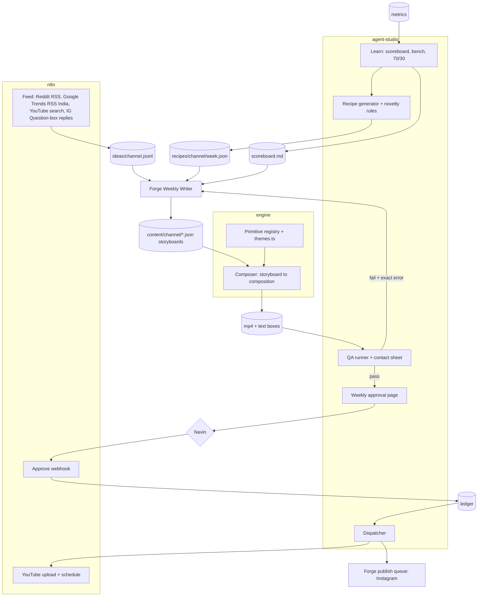

# TECH: agent-studio

Why: code picks the shape, an AI writes the words, a human approves once a week.

## Architecture

## Repos
One repo (ADR 7).

| Folder | Owns |
|---|---|
| `engine/` | Motion library (primitives), `themes.ts`, Composer, renderer, gate, watcher |
| root | Schemas, recipes, novelty, QA, approval page, dispatch, learn, channel config, docs |
| `~/Dev/projects/reel-engine` | Old live engine (v1). Read-only; retired at task B4b |

## Stack
| Layer | Choice |
|---|---|
| Rendering | Remotion 4, React 19, TypeScript (`engine/`, copied from reel-engine v1) |
| agent-studio language | TypeScript on Node 26 (type stripping, no build step, no dependencies), `studio/` (ADR 17) |
| Media checks | ffprobe |
| Automation | n8n (feeds, YouTube upload, approval webhook) |
| Writer | Forge (Muse tokens) |
| Storage | Files in repo `state/` and Google Drive; no database |
| Host | Navin's Mac (watcher via launchd) |

## Data contracts (`schemas/`)
| Schema | Written by | Read by |
|---|---|---|
| idea | Feed (n8n) | Writer |
| recipe | Recipe | Writer, QA |
| storyboard | Writer | Composer, QA |
| qa | QA | Approval page, Writer (on fail) |
| ledger | Approval webhook, Dispatch | Dispatch, Learn |
| metrics | TBD (owner: Navin) | Learn |
| fingerprint | Recipe | Recipe (novelty), QA |
| channel | Navin | All steps |

## Themes and role tokens
Role tokens (every theme defines all): `bg, surface, ink, muted, rule, accent, onAccent, flow, ok, alert, shadow`. `onAccent` is text on the highlighter (ADR 8).

| Theme | bg | surface | ink | accent | Default for |
|---|---|---|---|---|---|
| paper | #F4F1EA | #FFFFFF | #111111 | #C6F432 | C1 |
| ink | #0E0E0E | #1A1A1A | #F4F1EA | #C6F432 | C2, C3 |
| mono | #E4E3DF | #F4F4F2 | #161616 | #C6F432 | C2, C3 |
| studio | #FFFFFF | #F6F6F6 | #0B0B0B | #2B4BFF | C1 alternate, C3 |

Rules (enforced by `npm run gate:themes`, which `make.mjs` runs before every render): WCAG AA contrast (ink on bg, ink on surface, onAccent on accent, muted on bg and surface); max 3 colours per frame; no raw colour (hex, rgb, hsl, white, black) in `src/` outside `themes.ts`; new themes need Navin's OK once. Brand fixed everywhere: Inter Tight + JetBrains Mono, signal-lime highlighter, 3px strokes, hard offset shadows, ink-wipe end card, authorship line.

## Novelty rules (Recipe redraws until all pass)
| Check | Rule |
|---|---|
| Topic | Text similarity to last 60 posts (all channels) < 0.75 (trigram / TF-IDF) |
| Structure | Jaccard distance of primitive set + ordered pairs >= 0.6 vs each of the channel's last 10 |
| Opening | Differs from yesterday's; same opening at most 2 times in 7 days |
| Hero metaphor | Not repeated within 14 days on the channel |
| Theme | Not 3 days in a row on the channel |
| Hook pattern | Not 3 in a row; caption opener doesn't repeat the previous 2 posts |
| Cross-channel | Same recipe fingerprint never on two channels in the same week |

Code: `studio/novelty.ts` (the 7 rules, pure), `studio/recipe.ts` (seeded generator, `node studio/recipe.ts <channel> <week>` writes `recipes/<channel>/<week>.json`), test `studio/recipe.test.ts` (8 weeks x 2 channels, each rule fires on a crafted case; in `npm run check`). Recipe decides shape only, so it enforces structure, opening, theme, hook pattern and cross-channel; topic, hero metaphor and caption opener exist only after writing and are checked by QA with the same functions. Video shapes per format (host 8 beats, composed 6 beats) live in `FORMATS` in recipe.ts. Opening rule means a format with one opener (host: `host-hook`) runs at most 2 times a week.

## Primitives (`engine/src/primitives/`)
| Part | Where |
|---|---|
| Spec: family, channels, min/max seconds, cues, text limits, example (test storyboard) | `specs.ts` (pure data, readable from Node) |
| Validator for params | `validateParams(id, params)` in `specs.ts` |
| Component: one full-frame shot, `{p, dur, cues}`, draws only in the stage band y 280 to 1080 | `<id>.tsx`, registered in `index.ts` |
| Contact sheet (8 frames) and preview video | `Preview.tsx`; `npm run primitives [-- --all-themes]` |

## Composer (`engine/src/composer/`)
| Part | Where |
|---|---|
| Storyboard type, scene timing, cue frames, `validateStoryboard` (Node-readable) | `storyboard.ts` |
| Composition: one Sequence per scene, captions from `vo`, cues from `*accent*` runs, transitions cut / whip-pan / ink-wipe, voice audio | `Composer.tsx` |
| Scene length | vo estimate (or measured voice) within the primitive's min/max; measured voice is never cut |
| Render | `npm run make -- content/storyboards/<id>.json` (watcher also watches `content/storyboards/`) |
| Transitions | cut, whip-pan (motion blur), ink-wipe (from the bottom), pixel-wipe (120 px blocks in a fixed pseudo-random order, `lib/pixels.ts`) |
| Closing | the last scene must be a closer (`end-card` or `host-cta`) |
| Checks | `npm run check` = TypeScript (`tsc`, strict) + theme gate + text QA self-test + schema samples (`schemas/validate.ts`); run before every commit |

## Formats (ADR 13)
| Format | Look | Built from |
|---|---|---|
| story | Paper & Signal, one continuous world (`pile-to-flow`) | `engine/src/story/Story.tsx` (legacy, live) |
| composed | any theme, sequenced shots, keyword captions | primitives + Composer |
| host | `night` theme, a channel mascot hosting, karaoke captions always on | host primitives + Composer (`"host"`, `"captionStyle": "karaoke"` in the storyboard) |

Host layer (`engine/src/host/`): `mascots.tsx` (characters drawn in SVG with a 7-step pixel dither; inputs mouth, blink, tilt), `Host.tsx` (idle bob, blink every ~3 s, tilt toward the active panel, happy hop, pain shake; mouth from voice loudness via `@remotion/media-utils`, else pulsed on caption word timing; karaoke captions), `acting.ts` (pure maths, asserted in `npm run primitives`).

## QA checks (deterministic)
Schema and text limits, audio stream present, 1080x1920 @ 30fps, duration 20 to 45s, safe zones from text boxes measured at compose time, fingerprint distance, file naming. Output: qa JSON + contact sheet PNG.

Text boxes (built in A5): while a storyboard renders, `TextProbe` (Composer.tsx) measures every visible text block on settled frames (every 5th, fonts loaded, transitions skipped) and emits it as a Remotion `<Artifact>`. `make.mjs` writes `out/<id>/text-boxes.json` and runs `textcheck.ts`: error if text leaves any platform safe area (`SAFE_ZONES`: Instagram x 60..1020, y 250..1500; YouTube Shorts x 60..960, y 180..1530, the right 120 px is the button column) or its card. Layouts keep text inside `SIDE` = 120 px on both sides (theme.ts), plus 20 px headroom on zoomed big type; warning if a caption overlaps shot text. The render fails if any sampled frame did not report. Only visible text counts: boxes are trimmed to clipping ancestors; trimmed text is an error ("cut off by its window") unless it sits in a `data-tb-scroll` area (chat history). Stress fixture `engine/test/stress-ui.json` (every UI field and every host big-type field at max length) must render with 0 errors: `npm run stress`.

Length per format (`LENGTH` in storyboard.ts): host 40 to 60 s, composed 20 to 45 s. Before render the estimate only warns; after render the real length fails the render when every vo line was measured (voiced), and warns when it is still an estimate.

## Security
| Rule | Enforced by |
|---|---|
| Never read or print `.env` | `.claude/settings.json` deny rules; CLAUDE.md |
| No publish without ledger status "approved" | Dispatcher refuses otherwise |
| Claude never publishes; never force-pushes | CLAUDE.md; force push denied |
| Forge writes only JSON into content folders; never edits engine code | Forge skill standing rules |
| Ideas only from feeds with a source link | Writer rules; `meta.source` required by storyboard schema |
