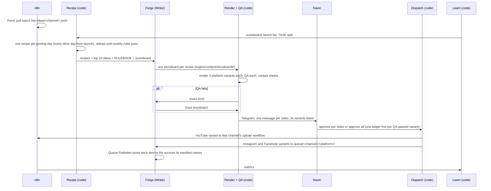

# WORKFLOW: the weekly loop

Why: one batch per channel per week keeps AI cost and human time fixed.

## Weekly sequence

## Human gates
| Gate | Who | When |
|---|---|---|
| Weekly approval | Navin | Once a week per channel, about 5 minutes |
| New theme | Navin | Once per theme |
| Commit + push | Navin | After `npm run check` passes |
| Channel launch | Navin | C2 after C1 runs 14 days with no missed posts; C3 after 20 approved videos |

## Failure paths
| Failure | What happens |
|---|---|
| Novelty rule fails | Recipe redraws |
| QA fails | Exact error per platform goes back to Forge; Forge fixes and resubmits; the variants that passed stay approvable. Max attempts TBD (owner: Navin) |
| A variant's account is not set up (e.g. an Instagram username pending, or a Facebook page without its page_id; a Facebook page with its page_id posts while its username is pending) | That variant is held alone; the others go out |
| A variant is refused at dispatch (mismatch, missing manifest, changed video, wrong destination) | Nothing is sent for it; Telegram "agent-studio needs you" with the reason |
| Mac asleep / missed render | Watcher retries; renders queue in Drive; missed day catches up |
| Video not approved | Not dispatched. Replacement policy TBD (owner: Navin) |
| Feed returns too few ideas | The Weekly Writer adds ideas itself, each with a real link it opened (no link, no idea) |

## Who does what
| Actor | Does | Never does |
|---|---|---|
| n8n | Feeds, YouTube upload (one workflow per channel), approval webhook, metrics pull | Writes words |
| Code | Recipe, QA, dispatch, learn | Publishes without approval |
| Forge | Writes words; posts Instagram and Facebook items from the queue, to the account each manifest names | Changes recipe shape, edits engine code, guesses an account |
| Navin | Approves weekly; approves commits; approves themes | Hand-edits storyboards (goal) |
| Claude | Builds engine and primitives; monthly audit | Runs in the weekly loop |
